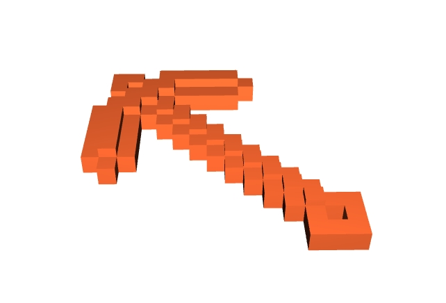
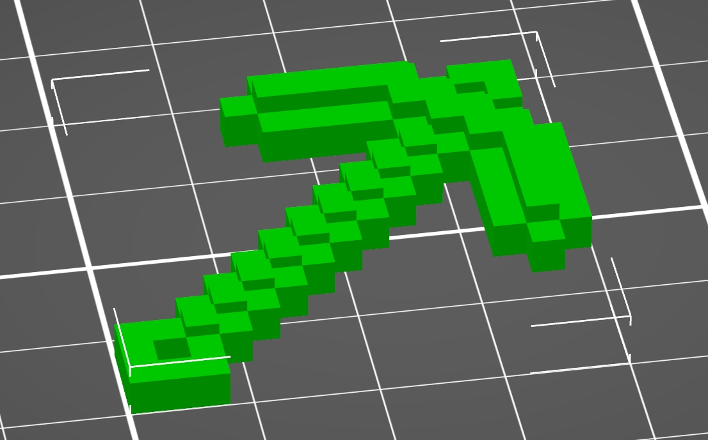
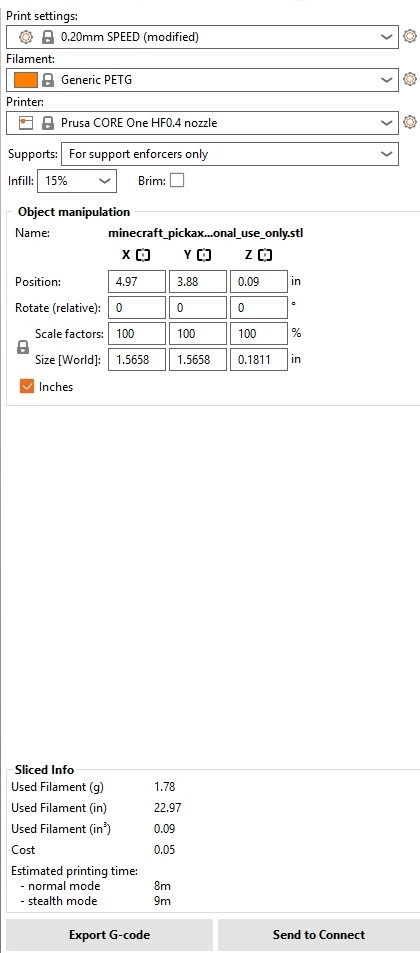
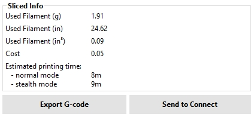
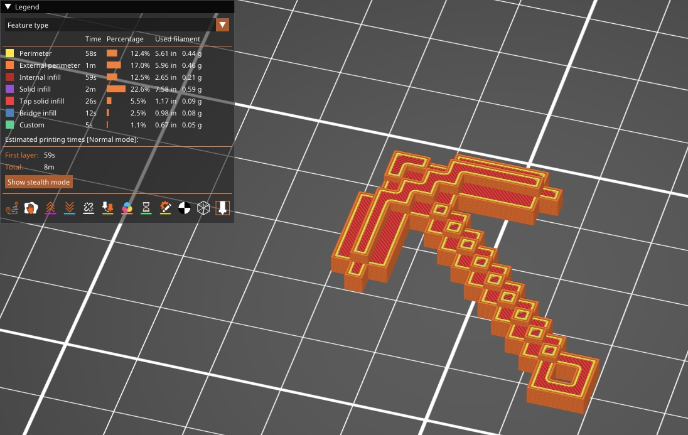
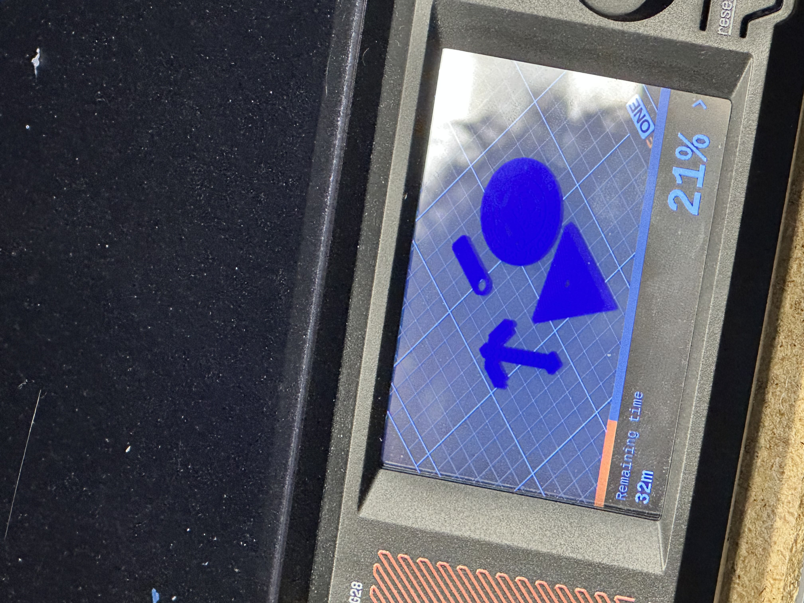

# L02 – Design and Slicing  

## In-Class Activity

### Individual Research: DfAM  
One rule to design for additive manufacturing is to make sure the self-supporting angle is a minimum of 45 degrees. This is to ensure the stability of the creation. This is to prevent the print from drooping. (Google AI Overview)  

### Individual Research: FDM  
One FDM-specific consideration is warping. Heat can melt the plastic and cause it to shrink as it cools. To prevent this, we can keep the base warm. (Google AI Overview)

### Group Share Out  
1. DfAM - Using the necessary amount of filament. This optimizes filament cost and time.
2. FDM - Making sure the holes are normal to the x-y axis. This is to consider that the 3d Printer is following a circular path. 

## Print something Small  
<small>***(Clicking on the images will enlarge them)***</small>
### Download and Preprocessor 
I downloaded the Minecraft_pickaxe_PERSONAL_USE_ONLY.stl from <a href="https://www.printables.com/model/1520127-minecraft-keychains-sword-pickaxe-creeper-head" target="_blank">https://www.printables.com/model/1520127-minecraft-keychains-sword-pickaxe-creeper-head</a>.  

Minecraft is one of my favorite games ever that I have played since I was a child. I chose the pickaxe because I would mine for a lot of materials and make cool redstone contraptions in the game. So, I decided to make a keychain of it to travel with me every day.    

  

  

The size of the keychain was perfect for the maximum area and height that was given, so there was no resizing needed. The area of the print is 1.5658 x 1.5658 x 0.1811.

  

  

Below are the print settings.

  

  

I then clicked "Slice Now" and kept the settings as-is and exported the print as G-Code to the flash drive for printing.  

    

  

### Print
As it was time to begin printing, the estimated time for printing was roughly 40 minutes due to printing with 3 other classmates at the same time. Dr. Fagan came to our group to analyze the reason for the long finish time and discovered that one of our prints was very detailed.  

     

  

After printing, a classmate began to take our prints off the bed. Unfortunately, the way he handled our prints had damaged mine. Below is a video provided by another classmate documenting the process.

<video width="100%" controls>
  <source src="Print Removal Process.mp4" type="video/mp4">
</video>

### Lessons Learned

