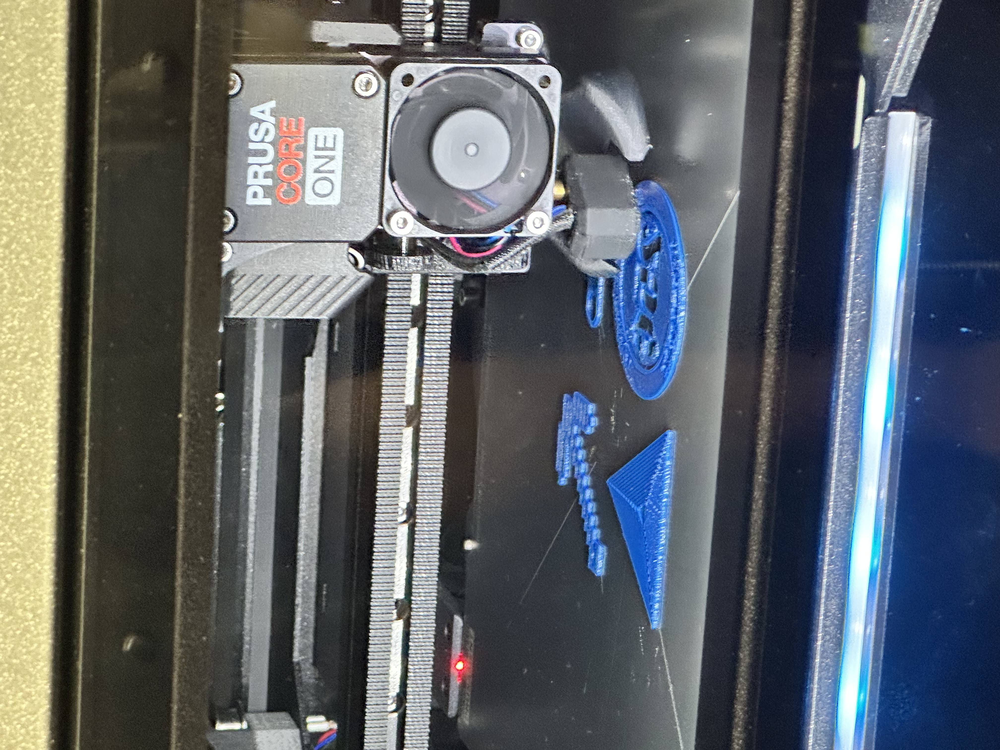
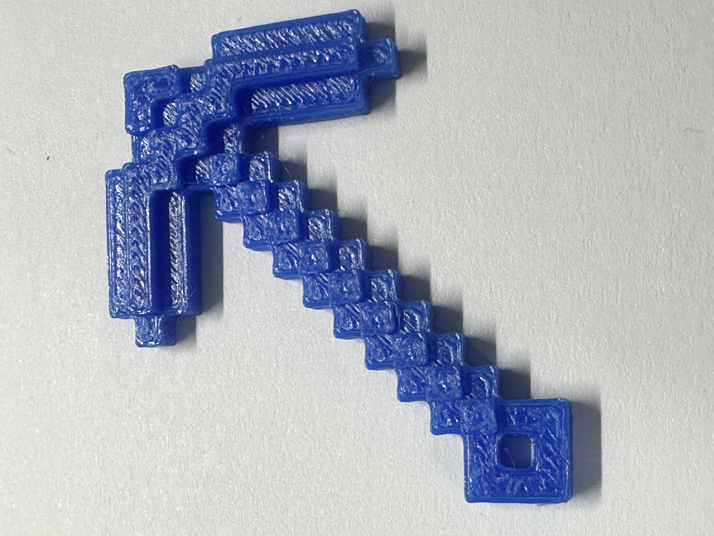
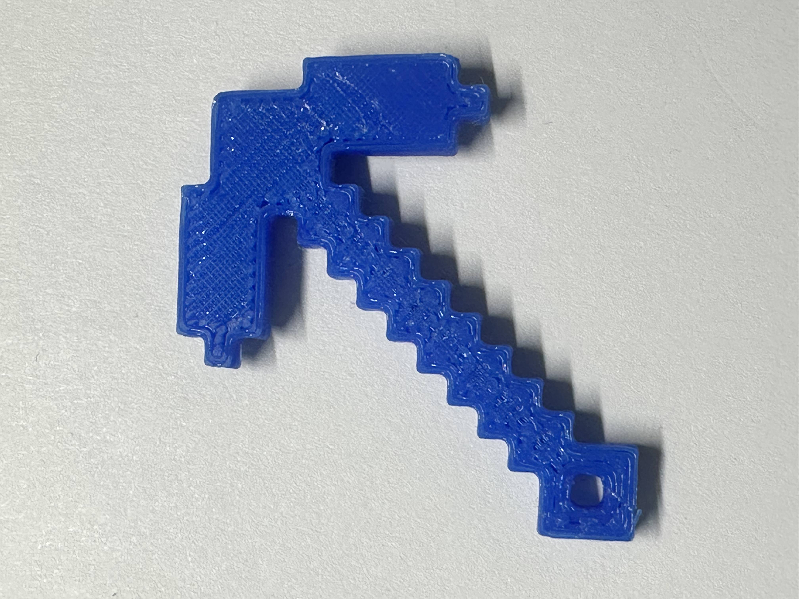

# L02 – Design and Slicing  

## In-Class Activity

### Individual Research: DfAM  
One rule to design for additive manufacturing is to make sure the self-supporting angle is a minimum of 45 degrees. This is to ensure the stability of the creation. This is to prevent the print from drooping. (Google AI Overview)  

### Individual Research: FDM  
One FDM-specific consideration is warping. Heat can melt the plastic and cause it to shrink as it cools. To prevent this, we can keep the base warm. (Google AI Overview)

### Group Share Out  
1. DfAM - Using the necessary amount of filament. This optimizes filament cost and time.
2. FDM - Making sure the holes are normal to the x-y axis. This is to consider that the 3d Printer is following a circular path. 

## Print something Small  
<small>***(Clicking on the images will enlarge them)***</small>
### Download and Preprocessor 
I downloaded the *Minecraft_pickaxe_PERSONAL_USE_ONLY.stl* from <a href="https://www.printables.com/model/1520127-minecraft-keychains-sword-pickaxe-creeper-head" target="_blank">https://www.printables.com/model/1520127-minecraft-keychains-sword-pickaxe-creeper-head</a>.  

Minecraft is one of my favorite games ever that I have played since I was a child. I chose the pickaxe because I would mine for a lot of materials and make cool redstone contraptions in the game. So, I decided to make a keychain of it to travel with me every day.    

  <figure style="display: inline-block; margin: 10px; vertical-align: top;">
    
    <figcaption style="font-size: 0.85em; color: gray; margin-top: 5px;">
      3D Model of Minecraft Pickaxe
    </figcaption>
  </figure>

  

The size of the keychain was perfect for the maximum area and height that was given, so there was no resizing needed. The area of the print is 1.5658 x 1.5658 x 0.1811.

  <figure style="display: inline-block; margin: 10px; vertical-align: top;">
    
    <figcaption style="font-size: 0.85em; color: gray; margin-top: 5px;">
      Minecraft Pickaxe on Prusa Slicer
    </figcaption>
  </figure>

 

Below are the print settings.

  <figure style="display: inline-block; margin: 10px; vertical-align: top;">
    
    <figcaption style="font-size: 0.85em; color: gray; margin-top: 5px;">
      Prusa Print Settings for Minecraft Pickaxe
    </figcaption>
  </figure>

  

I then clicked "Slice Now" and kept the settings as-is and exported the print as G-Code to the flash drive for printing.  

  <!-- Left Screenshot Container -->
  <figure style="display: inline-block; margin: 10px; vertical-align: top;">
    
    <figcaption style="font-size: 0.85em; color: gray; margin-top: 5px;">
      Sliced Info
    </figcaption>
  </figure>

  <!-- Right Screenshot Container -->
  <figure style="display: inline-block; margin: 10px; vertical-align: top;">
    
    <figcaption style="font-size: 0.85em; color: gray; margin-top: 5px;">
      Features
    </figcaption>
  </figure>

 

### Print
As it was time to begin printing, the estimated time for printing was roughly 40 minutes due to printing with 3 other classmates at the same time. Dr. Fagan came to our group to analyze the reason for the long finish time and discovered that one of our prints was very detailed.  

  <!-- Left Photo Container -->
  <figure style="display: inline-block; margin: 10px; vertical-align: top;">
    
    <figcaption style="font-size: 0.85em; color: gray; margin-top: 5px;">
      Print Progress
    </figcaption>
  </figure>

  <!-- Right Photo Container -->
  <figure style="display: inline-block; margin: 10px; vertical-align: top;">
    
    <figcaption style="font-size: 0.85em; color: gray; margin-top: 5px;">
      Printer Setup
    </figcaption>
  </figure>

  

After printing, a classmate began to take our prints off the bed. Unfortunately, the way he handled our prints had damaged mine. Below is a video provided by another classmate documenting the process.

  <figure style="display: inline-block; margin: 10px; width: 35%; vertical-align: top;">
    <video width="100%" controls>
      <source src="Print Removal Process.mp4" type="video/mp4">
      Your browser does not support the video tag.
    </video>
    <figcaption style="font-size: 0.85em; color: gray; margin-top: 8px; text-align: center;">
      Print Removal Process
    </figcaption>
  </figure>

  

Below are pictures of the finished product.

  <!-- Left Image + Label Container -->
  <figure style="display: inline-block; margin: 10px; vertical-align: top;">
    
    <figcaption style="font-size: 0.85em; color: gray; margin-top: 5px;">
      Front View
    </figcaption>
  </figure>

  <!-- Right Image + Label Container -->
  <figure style="display: inline-block; margin: 10px; vertical-align: top;">
    
    <figcaption style="font-size: 0.85em; color: gray; margin-top: 5px;">
      Back View
    </figcaption>
  </figure>

### Lessons Learned
In this lab, I learned about the important rules about 3D printing. I learned how to 3D print for the first time, and I hope to do a lot more in the future. I learned a lot more about HTML codes, such as how to make images enlarge when clicking on them for this portfolio. I hope to be present the next time my print is finished so that I can handle my own print with caution. The time spent from downloading to finishing the 3D print was under an hour. I would like to thank Austin Williams for collecting the teams download and printing it for us, and Maxwell McFarlane for doing his best to take our print off the bed. Credit to Atiba Johnson for documenting the post-printing process. 

## Resources
All printwork was used with:  

* <a href="https://www.prusa3d.com/p/prusaslicer/" target="_blank">PrusaSlicer</a>  
* <a href="https://www.printables.com/" target="_blank">Printables.com</a>  
* <a href="https://www.prusa3d.com/product/prusa-core-one-kit/" target="_blank">Prusa CORE One Printer</a>  

