# Lab #3 – Design Something Small

<small>***(Clicking on the images will enlarge them)***</small>

## Design and Modeling Steps
For this lab, I wanted to design a print-in-place fidget toy using PTC Creo. The idea was to have two interlocking gears inside an outer shell, so you could spin them with your thumb. To meet the lab constraints, I kept the whole thing super small: exactly 1.0" x 0.5" x 0.25". Here is exactly how I built it step-by-step.

### 1. Modeling the Gear
I started with the gear. First, I sketched a hollow circle on the top plane with an inner diameter of 0.4" and an outer diameter of 0.45". Putting it on the top plane made it way easier to translate later during assembly. I extruded it symmetrically by 0.13".

  <figure style="display: inline-block; margin: 10px; vertical-align: top;">
    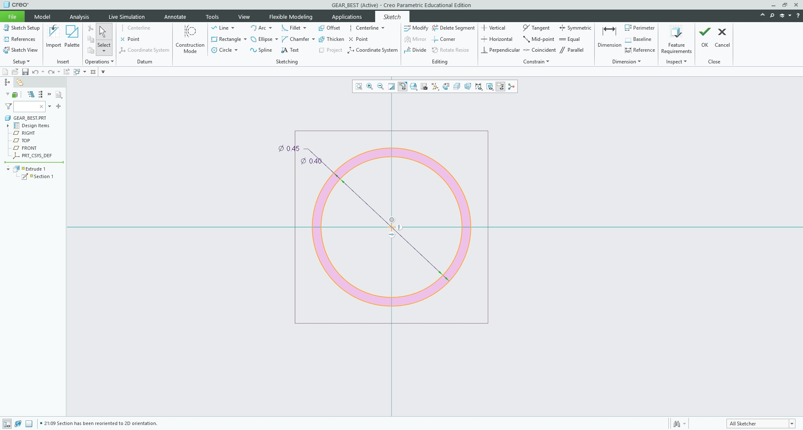
    <figcaption style="font-size: 0.85em; color: gray; margin-top: 5px;">
      Hollow Circle Sketch (0.4" and 0.45" Dia)
    </figcaption>
  </figure>
  <figure style="display: inline-block; margin: 10px; vertical-align: top;">
    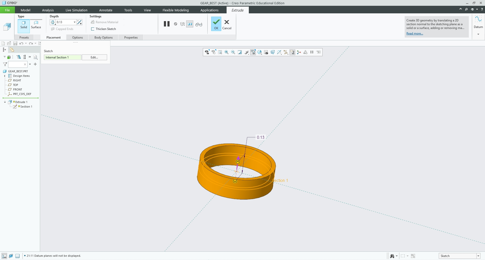
    <figcaption style="font-size: 0.85em; color: gray; margin-top: 5px;">
      Symmetric Extrusion to 0.13"
    </figcaption>
  </figure>

Next, I created another sketch on the top plane using the inner diameter as a reference and extruded it by 0.065".

  <figure style="display: inline-block; margin: 10px; vertical-align: top;">
    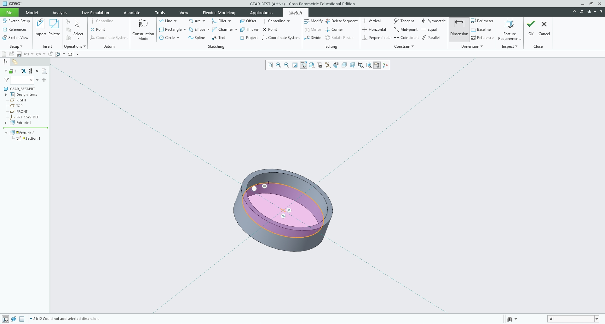
    <figcaption style="font-size: 0.85em; color: gray; margin-top: 5px;">
      Inner Base Sketch
    </figcaption>
  </figure>
  <figure style="display: inline-block; margin: 10px; vertical-align: top;">
    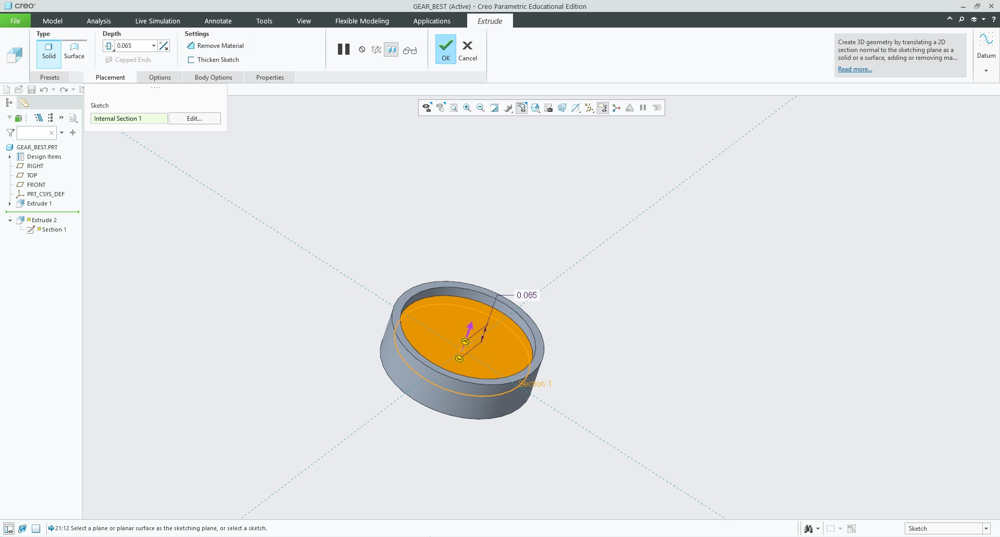
    <figcaption style="font-size: 0.85em; color: gray; margin-top: 5px;">
      Inner Extrusion to 0.065"
    </figcaption>
  </figure>

For the gear teeth, I kind of eyeballed a custom profile sketch. Once I had one tooth looking right, I made it a local group and used a circular pattern to duplicate it to 24 teeth total.

  <figure style="display: inline-block; margin: 10px; vertical-align: top;">
    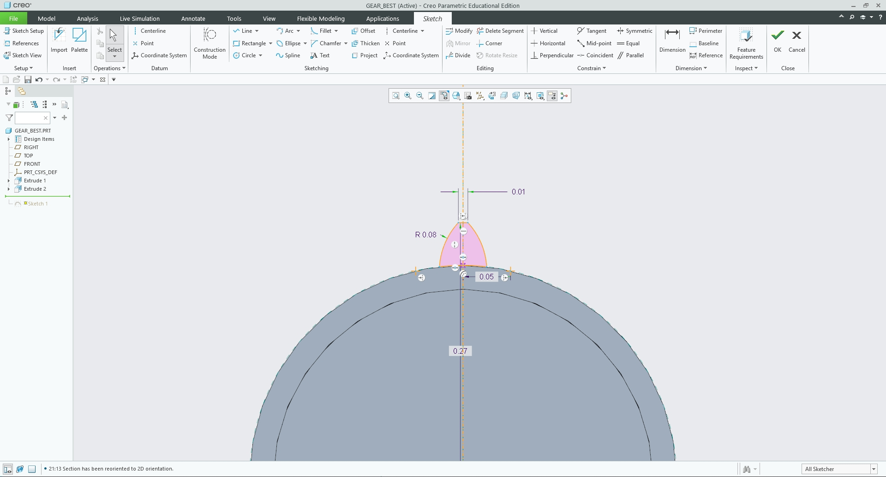
    <figcaption style="font-size: 0.85em; color: gray; margin-top: 5px;">
      Single Tooth Profile
    </figcaption>
  </figure>
  <figure style="display: inline-block; margin: 10px; vertical-align: top;">
    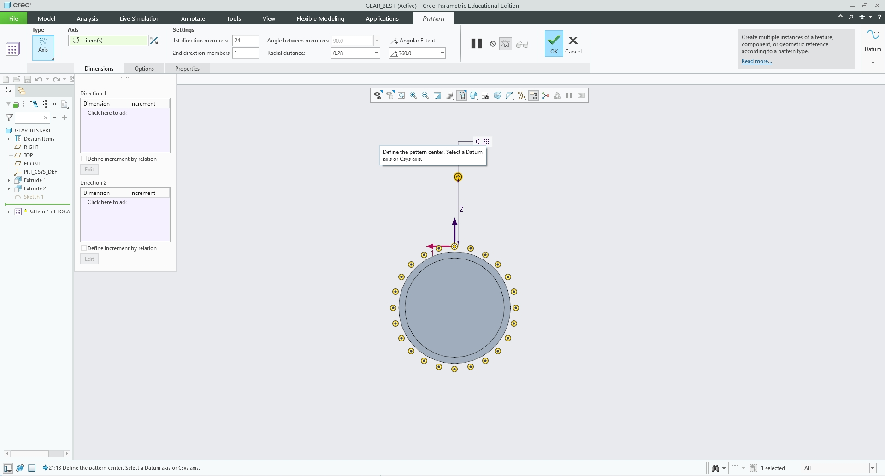
    <figcaption style="font-size: 0.85em; color: gray; margin-top: 5px;">
      Circular Pattern of 24 Teeth
    </figcaption>
  </figure>

To finish the gear, I cut a 0.10" hole straight through the center and chamfered the edges of the hole so it would spin smoothly on the shell's post later.

  <figure style="display: inline-block; margin: 10px; vertical-align: top;">
    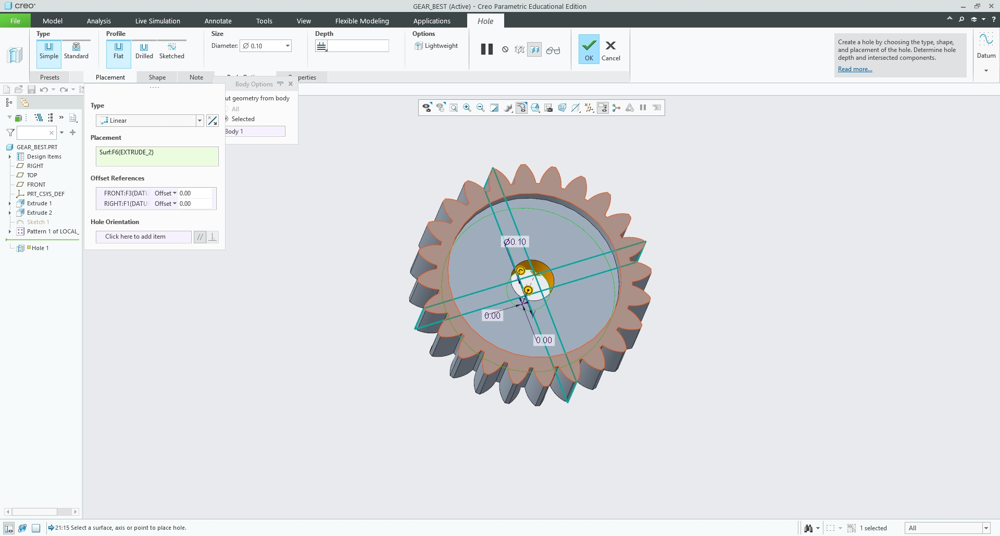
    <figcaption style="font-size: 0.85em; color: gray; margin-top: 5px;">
      0.10" Center Hole Cut
    </figcaption>
  </figure>
  <figure style="display: inline-block; margin: 10px; vertical-align: top;">
    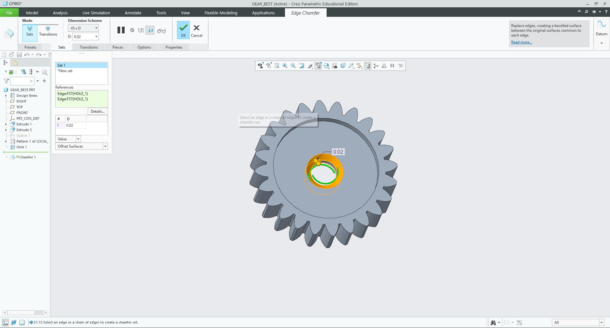
    <figcaption style="font-size: 0.85em; color: gray; margin-top: 5px;">
      Chamfered Edges
    </figcaption>
  </figure>

### 2. Modeling the Shell Base
I created a brand new part file for the outer shell. I sketched the main rectangular footprint and extruded it 0.25" high.

  <figure style="display: inline-block; margin: 10px; vertical-align: top;">
    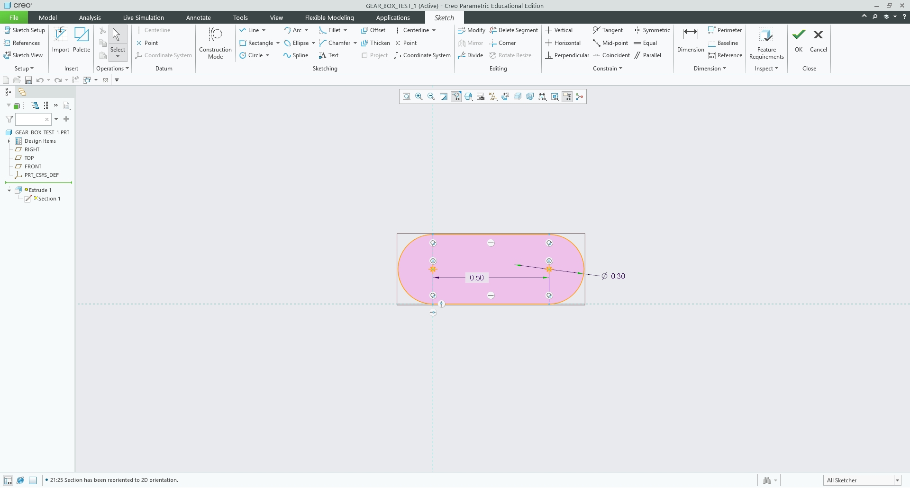
    <figcaption style="font-size: 0.85em; color: gray; margin-top: 5px;">
      Base Profile Sketch
    </figcaption>
  </figure>
  <figure style="display: inline-block; margin: 10px; vertical-align: top;">
    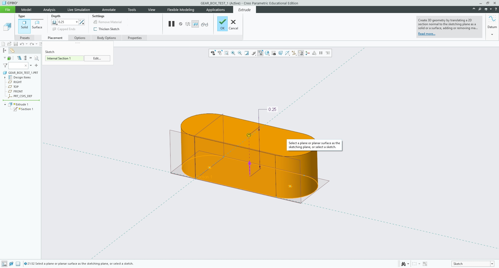
    <figcaption style="font-size: 0.85em; color: gray; margin-top: 5px;">
      Extruded to 0.25" High
    </figcaption>
  </figure>

To make room for the gears, I sketched on the side face of the block and did an extruded cut to hollow out the middle section.

  <figure style="display: inline-block; margin: 10px; vertical-align: top;">
    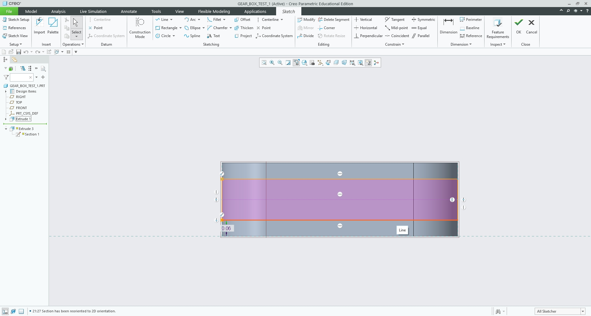
    <figcaption style="font-size: 0.85em; color: gray; margin-top: 5px;">
      Side Sketch for Cavity
    </figcaption>
  </figure>
  <figure style="display: inline-block; margin: 10px; vertical-align: top;">
    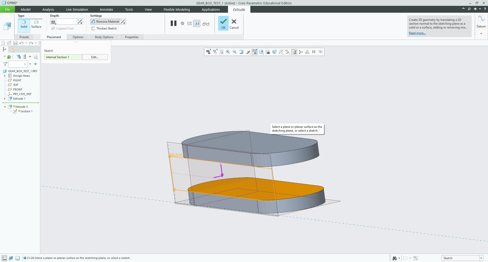
    <figcaption style="font-size: 0.85em; color: gray; margin-top: 5px;">
      Extruded Cut (Material Removal)
    </figcaption>
  </figure>

I needed a way to actually touch the gears with my thumb, so I cut a 0.3" x 0.15" rectangular window through both the top and bottom of the base.

  <figure style="display: inline-block; margin: 10px; vertical-align: top;">
    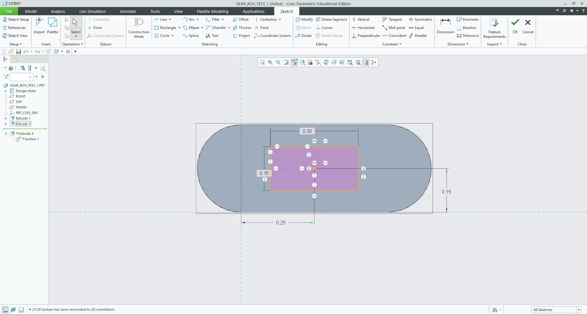
    <figcaption style="font-size: 0.85em; color: gray; margin-top: 5px;">
      0.3" x 0.15" Rectangle Sketch
    </figcaption>
  </figure>
  <figure style="display: inline-block; margin: 10px; vertical-align: top;">
    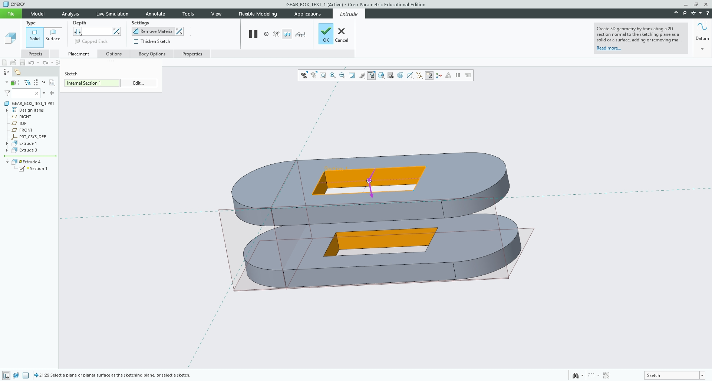
    <figcaption style="font-size: 0.85em; color: gray; margin-top: 5px;">
      Window Extruded Cut
    </figcaption>
  </figure>

To give it a cleaner look, I added rounds (fillets) to the inside corners of those rectangular windows, and then did the same to the outer edges of the main base block.

  <figure style="display: inline-block; margin: 10px; vertical-align: top;">
    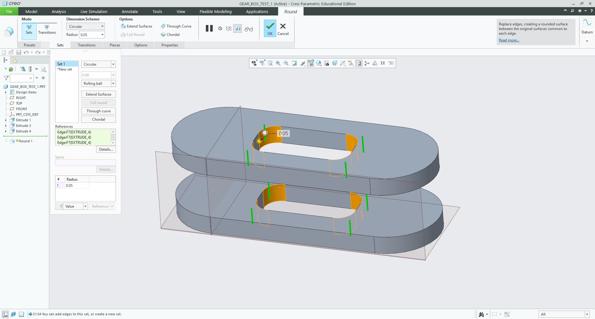
    <figcaption style="font-size: 0.85em; color: gray; margin-top: 5px;">
      Rounded Window Corners
    </figcaption>
  </figure>
  <figure style="display: inline-block; margin: 10px; vertical-align: top;">
    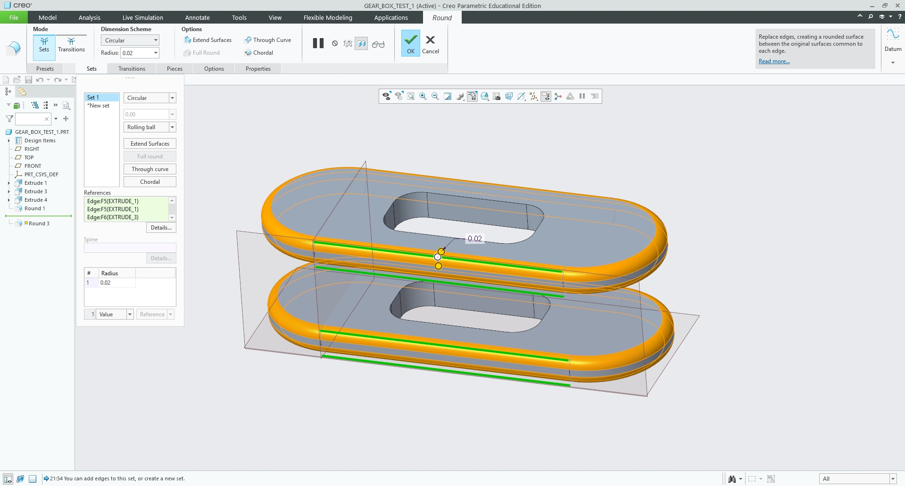
    <figcaption style="font-size: 0.85em; color: gray; margin-top: 5px;">
      Rounded Outer Base Edges
    </figcaption>
  </figure>

Next, I had to create the internal posts for the gears to sit on. I added an extra datum plane running the long way down the middle of the base, and placed an axis at the exact center of the internal circular edge.

  <figure style="display: inline-block; margin: 10px; vertical-align: top;">
    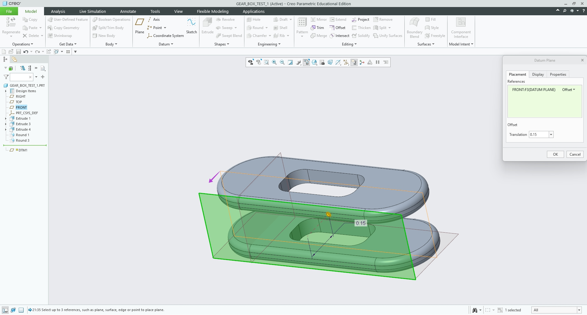
    <figcaption style="font-size: 0.85em; color: gray; margin-top: 5px;">
      Center Datum Plane
    </figcaption>
  </figure>
  <figure style="display: inline-block; margin: 10px; vertical-align: top;">
    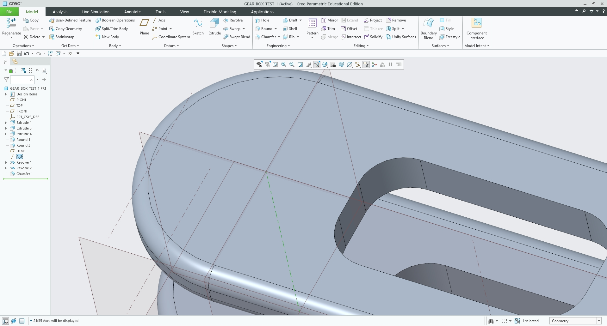
    <figcaption style="font-size: 0.85em; color: gray; margin-top: 5px;">
      Axis Placement
    </figcaption>
  </figure>

Using that axis, I did a revolve feature to build the post holding the gear. I repeated this exact same revolve process for the other side of the shell to create the second post. Finally, I chamfered the tips of those posts to match the angle of the gear holes.

  <figure style="display: inline-block; margin: 10px; vertical-align: top;">
    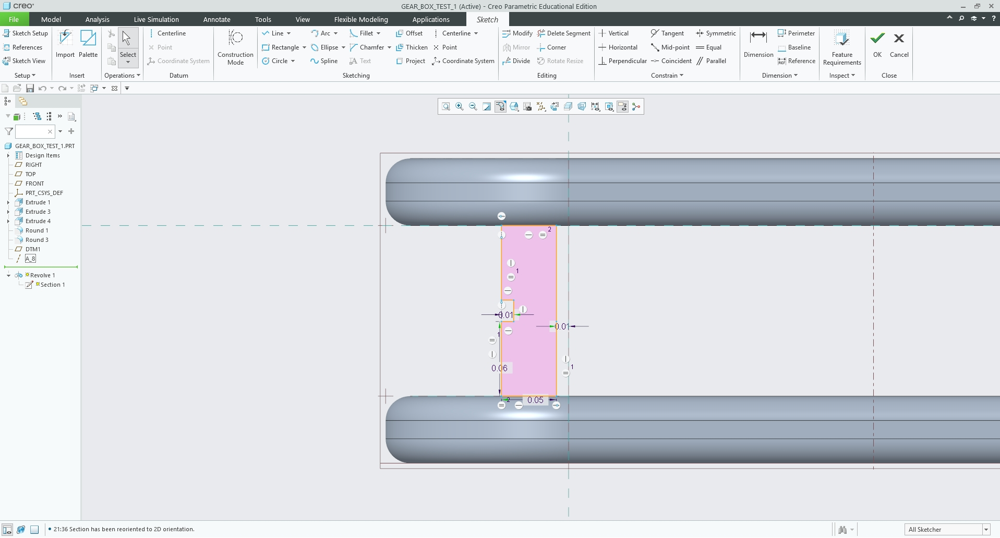
    <figcaption style="font-size: 0.85em; color: gray; margin-top: 5px;">
      First Revolve Sketch Dimensions
    </figcaption>
  </figure>
  <figure style="display: inline-block; margin: 10px; vertical-align: top;">
    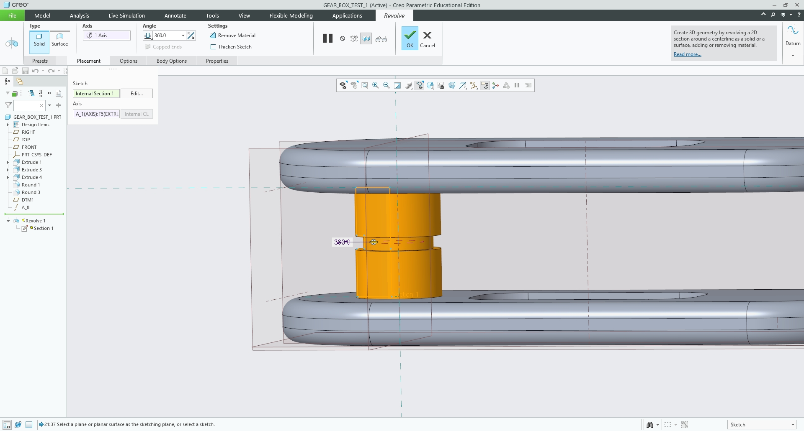
    <figcaption style="font-size: 0.85em; color: gray; margin-top: 5px;">
      First Post Revolve Feature
    </figcaption>
  </figure>

I then repeated this exact same process for the second post on the other side of the shell, creating the sketch and revolving it around the second axis. Finally, I chamfered the post edges to match the gear hole angle.

  <figure style="display: inline-block; margin: 10px; vertical-align: top;">
    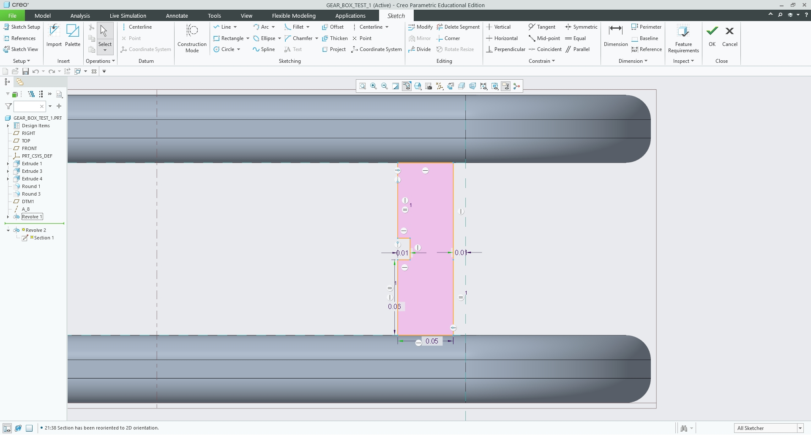
    <figcaption style="font-size: 0.85em; color: gray; margin-top: 5px;">
      Second Revolve Sketch Dimensions
    </figcaption>
  </figure>
  <figure style="display: inline-block; margin: 10px; vertical-align: top;">
    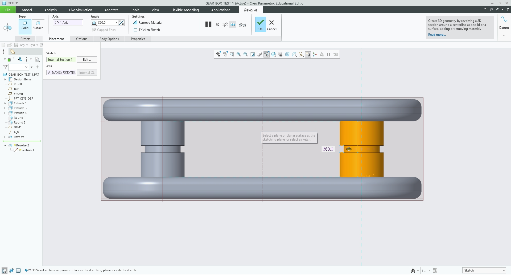
    <figcaption style="font-size: 0.85em; color: gray; margin-top: 5px;">
      Second Post Revolve Feature
    </figcaption>
  </figure>

Lastly, I chamfered the edges of those revolved posts so they would match the angle of the gear holes and allow the gears to sit smoothly.

  <figure style="display: inline-block; margin: 10px; vertical-align: top;">
    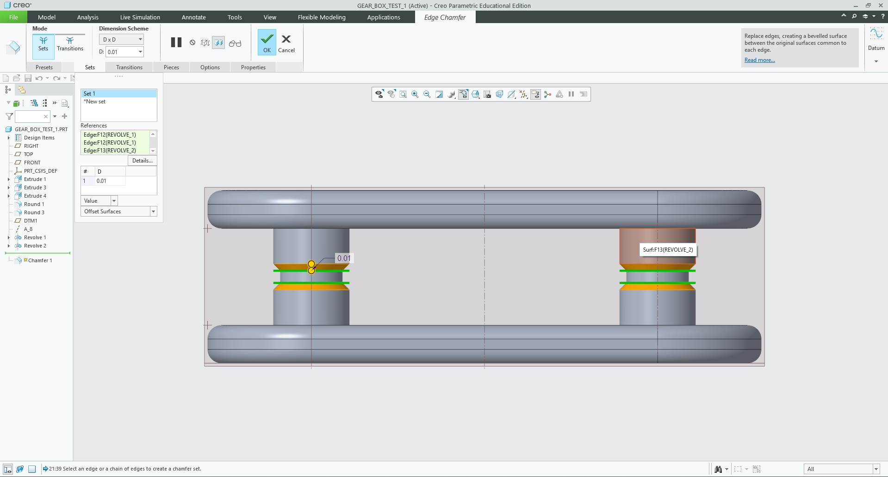
    <figcaption style="font-size: 0.85em; color: gray; margin-top: 5px;">
      First Post Chamfer
    </figcaption>
  </figure>

### 3. Assembly
With both parts done, I opened a new `.asm` assembly file. I dragged the shell base in first and set its constraint to "Default" so it wouldn't float around.

  <figure style="display: inline-block; margin: 10px; vertical-align: top;">
    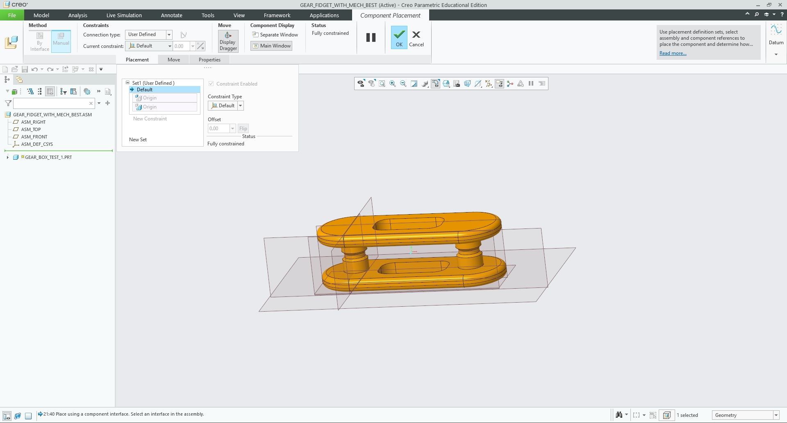
    <figcaption style="font-size: 0.85em; color: gray; margin-top: 5px;">
      Shell Inserted with Default Constraint
    </figcaption>
  </figure>

Then I brought in the first gear. Instead of a rigid constraint, I switched the connection type to "Pin" and locked it onto the first post inside the shell. I brought in the second gear and pinned it to the other post.

  <figure style="display: inline-block; margin: 10px; vertical-align: top;">
    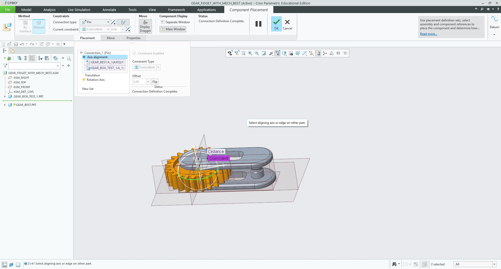
    <figcaption style="font-size: 0.85em; color: gray; margin-top: 5px;">
      First Gear Pinned to Post
    </figcaption>
  </figure>
  <figure style="display: inline-block; margin: 10px; vertical-align: top;">
    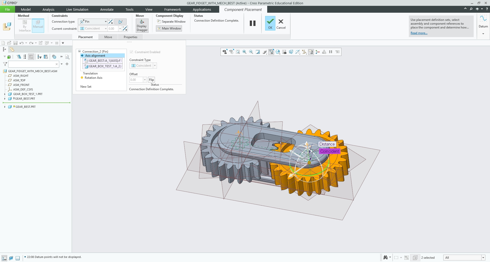
    <figcaption style="font-size: 0.85em; color: gray; margin-top: 5px;">
      Second Gear Pinned to Post
    </figcaption>
  </figure>

  <figure style="display: inline-block; margin: 10px; vertical-align: top;">
    
    <figcaption style="font-size: 0.85em; color: gray; margin-top: 5px;">
      3D Model of Gear Fidget Toy in Creo
    </figcaption>
  </figure>

As a final test, I ran a Mechanism Analysis in Creo to see if the gears would actually interact and spin properly. It worked perfectly!

  <figure style="display: inline-block; margin: 10px; width: 60%; vertical-align: top;">
    <video width="100%" controls>
      <source src="0908.mp4" type="video/mp4">
      Your browser does not support the video tag.
    </video>
    <figcaption style="font-size: 0.85em; color: gray; margin-top: 8px; text-align: center;">
      Mechanism Analysis in Creo
    </figcaption>
  </figure>

## Research
Besides the Honeycomb and Gyroid patterns we talked about in class, here are three other infill types and what they're used for:

* **Cubic:** This stacks cubes at a 45-degree angle inside your print. It's really good if your mechanical part needs to be strong in all three directions (X, Y, and Z).
* **Grid (or Triangles):** This is basically a 2D network. It's strong across the print bed (the X and Y axes) but not as strong vertically. It's used a lot for flat, weight-bearing surfaces.
* **Lightning:** This one basically just builds support structures right under the top layers. It saves a ton of filament and print time, but it offers almost no mechanical strength. It's strictly for display models.

**How does percentage infill affect mechanical properties?**
More infill means a stronger, heavier, and stiffer part. However, there's a limit. Going past 50% infill usually just wastes material and time without adding much extra strength. A 100% infill is almost never worth it for a standard part.

**How do different infill patterns affect mechanical properties?**
The pattern decides *where* the part is strong. 2D patterns (like Grid) are great for side-to-side strength but buckle easily under vertical pressure. 3D patterns (like Cubic) spread the load out so the part can take stress from pretty much any direction without breaking.

## Preprocessor and Printing
* **Build Orientation:** I laid the model completely flat on its widest side. This gave the gear profiles the best resolution and kept them from snapping off, which probably would have happened if I printed it standing up.
* **Scale:** I didn't need to scale it in the slicer since I designed it strictly to the lab dimensions in Creo.
* **Infill:** We went with **20% infill**. This was plenty of structure for the shell and guaranteed the print would finish well under the 1.5-hour limit.
* **Wall Thickness:** I bumped up the wall thickness to reinforce the outer shell. **Why use different wall thicknesses?** Adding more outer walls (perimeters) actually does way more for a part's bending strength and impact resistance than just cranking up the infill percentage.
* **Mistakes:** I accidentally added supports in PrusaSlicer to keep the gears from sticking to the shell, completely forgetting the "no overhangs" rule for this lab. Next time, I need to design chamfers so it prints cleanly without supports.

  <figure style="display: inline-block; margin: 10px; vertical-align: top;">
    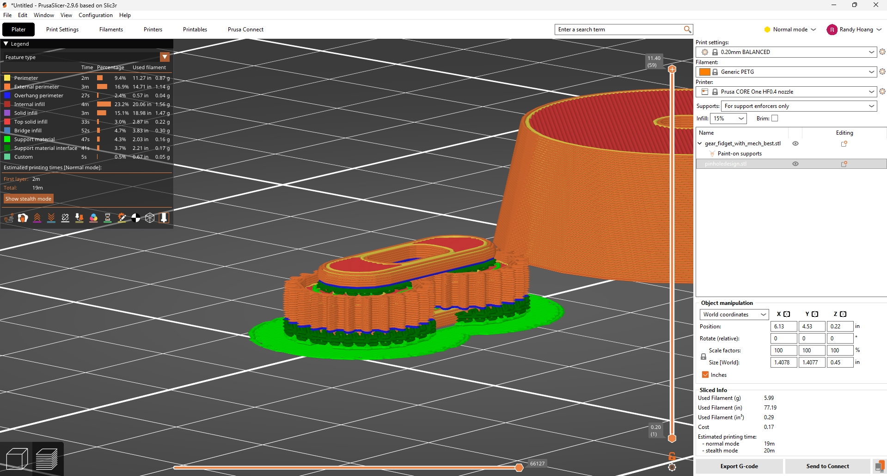
    <figcaption style="font-size: 0.85em; color: gray; margin-top: 5px;">
      PrusaSlicer Settings and Estimated Time
    </figcaption>
  </figure>

## Print
We printed this at the Rapid Lab using PETG. Since we printed as a group of 3, the total time was about 40 minutes.

  <figure style="display: inline-block; margin: 10px; width: 50%; vertical-align: top;">
    <video width="100%" controls>
      <source src="0907.mp4" type="video/mp4">
      Your browser does not support the video tag.
    </video>
    <figcaption style="font-size: 0.85em; color: gray; margin-top: 8px; text-align: center;">
      3D Printing Process
    </figcaption>
  </figure>

**Stipulation Checklist:**
* **< 0.5 inch tall:** Pass (0.25 inches)
* **No overhangs:** Fail (I had to use supports)
* **Print in PLA/PETG:** Pass
* **< 1.5 x 1.5 inches:** Pass (1.0 x 0.5 inches)
* **Time < 1.5 hours:** Pass (40 minutes)

  <figure style="display: inline-block; margin: 10px; vertical-align: top;">
    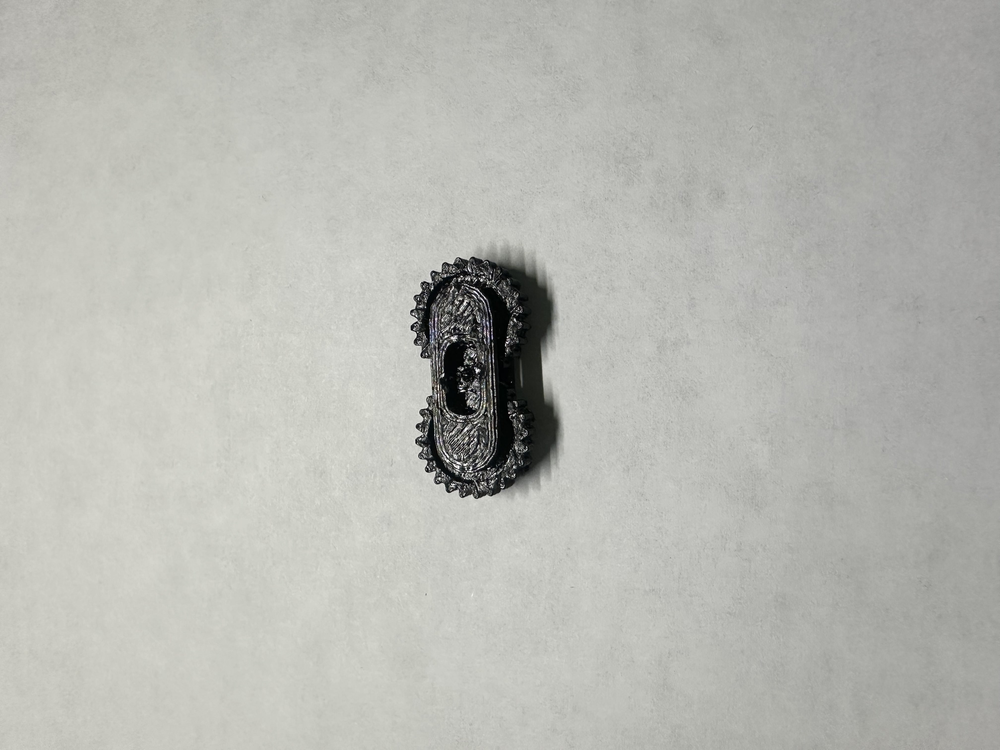
    <figcaption style="font-size: 0.85em; color: gray; margin-top: 5px;">
      Final 3D Printed Fidget Toy (Fused Gears)
    </figcaption>
  </figure>

## Lessons Learned
This print was definitely a learning experience. Right at the start, the filament jammed and wouldn't feed properly. We had to get Dr. Fagan to come help us fix the extruder and restart the print completely.

In the end, my fidget toy didn't work. The gears completely fused to the outer shell. At first, I thought maybe the 20% infill caused it to mess up, but it was really a tolerance issue. Because the toy was so tiny, I didn't leave enough of a gap in Creo between the gears and the wall. When the hot plastic extruded, it expanded and welded everything together. I probably needed to leave at least a 0.2mm to 0.3mm clearance gap.

If I made a mistake like this on a real safety part (like a load-bearing pulley or hinge), the friction would ruin the joint and cause it to fail immediately. The filament jam was an obvious mistake that I caught right away by watching the first layer, but the tight tolerances were a hidden flaw. Next time, my process needs to include using the measure tool in Creo to check the exact clearances before I export the STL.

You can see these concepts in real products, like a heavy-duty power drill housing. The wall thickness and infill strategy decide how drop-resistant it is. If the walls are too thin or the infill is weak, dropping the drill could shatter the case and expose you to the motor or live wires.

## Resources

All design and printwork was done with:

<ul style="list-style-type: circle !important; padding-left: 20px;">
  <li style="list-style-type: circle !important; margin-bottom: 4px;">
    PTC Creo
  </li>
  <li style="list-style-type: circle !important; margin-bottom: 4px;">
    <a href="https://www.prusa3d.com/p/prusaslicer/" target="_blank">PrusaSlicer</a>
  </li>
  <li style="list-style-type: circle !important; margin-bottom: 4px;">
    Rapid Lab
  </li>
  <li style="list-style-type: circle !important; margin-bottom: 4px;">
    Dr. Fagan (Troubleshooting assistance)
  </li>
</ul>
