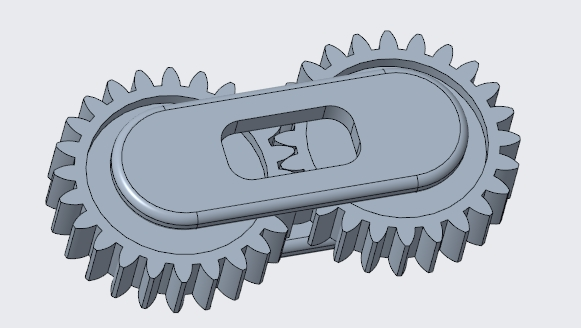

<h1>Lab #3 &ndash; Design Something Small</h1>

<small><em><strong>(Clicking on the images will enlarge them)</strong></em></small>

<h2>Design</h2>

For this lab, I wanted to design a print-in-place fidget toy using PTC Creo. The idea was to have two interlocking gears inside an outer shell, so you could spin them with your thumb.

To meet the lab constraints, I kept the whole thing super small: exactly 1.0" x 0.5" x 0.25". I sketched and extruded the gears first to make sure the teeth actually meshed, and then I built the casing around them with a cutout for finger access.

  <figure style="display: inline-block; margin: 10px; vertical-align: top;">
    
    <figcaption style="font-size: 0.85em; color: gray; margin-top: 5px;">
      3D Model of Gear Fidget Toy in Creo
    </figcaption>
  </figure>

<h2>Research</h2>

Besides the Honeycomb and Gyroid patterns we talked about in class, here are three other infill types and what they're used for:

<ul>
  <li><strong>Cubic:</strong> This stacks cubes at a 45-degree angle inside your print. It's really good if your mechanical part needs to be strong in all three directions (X, Y, and Z).</li>
  <li><strong>Grid (or Triangles):</strong> This is basically a 2D network. It's strong across the print bed (the X and Y axes) but not as strong vertically. It's used a lot for flat, weight-bearing surfaces.</li>
  <li><strong>Lightning:</strong> This one basically just builds support structures right under the top layers. It saves a ton of filament and print time, but it offers almost no mechanical strength. It's strictly for display models.</li>
</ul>

<strong>How does percentage infill affect mechanical properties?</strong> 
More infill means a stronger, heavier, and stiffer part. However, there's a limit. Going past 50% infill usually just wastes material and time without adding much extra strength. A 100% infill is almost never worth it for a standard part.

<strong>How do different infill patterns affect mechanical properties?</strong> 
The pattern decides <em>where</em> the part is strong. 2D patterns (like Grid) are great for side-to-side strength but buckle easily under vertical pressure. 3D patterns (like Cubic) spread the load out so the part can take stress from pretty much any direction without breaking.

<h2>Preprocessor and Printing</h2>
<ul>
  <li><strong>Build Orientation:</strong> I laid the model completely flat on its widest side. This gave the gear profiles the best resolution and kept them from snapping off, which probably would have happened if I printed it standing up.</li>
  <li><strong>Scale:</strong> I didn't need to scale it in the slicer since I designed it strictly to the lab dimensions in Creo.</li>
  <li><strong>Infill:</strong> We went with <strong>20% infill</strong>. This was plenty of structure for the shell and guaranteed the print would finish well under the 1.5-hour limit.</li>
  <li><strong>Wall Thickness:</strong> I bumped up the wall thickness to reinforce the outer shell. <strong>Why use different wall thicknesses?</strong> Adding more outer walls (perimeters) actually does way more for a part's bending strength and impact resistance than just cranking up the infill percentage.</li>
  <li><strong>Mistakes:</strong> I accidentally added supports in PrusaSlicer to keep the gears from sticking to the shell, completely forgetting the "no overhangs" rule for this lab. Next time, I need to design chamfers so it prints cleanly without supports.</li>
</ul>

  <figure style="display: inline-block; margin: 10px; vertical-align: top;">
    
    <figcaption style="font-size: 0.85em; color: gray; margin-top: 5px;">
      PrusaSlicer Settings and Estimated Time
    </figcaption>
  </figure>

<h2>Print</h2>

We printed this at the UNCC Print Farm using PLA. Since we printed as a group, the total time was about 40 minutes.

<strong>Stipulation Checklist:</strong>

<ul>
  <li><strong>&lt; 0.5 inch tall:</strong> Pass (0.25 inches)</li>
  <li><strong>No overhangs:</strong> Fail (I had to use supports)</li>
  <li><strong>Print in PLA/PETG:</strong> Pass</li>
  <li><strong>&lt; 1.5 x 1.5 inches:</strong> Pass (1.0 x 0.5 inches)</li>
  <li><strong>Time &lt; 1.5 hours:</strong> Pass (40 minutes)</li>
</ul>

  <figure style="display: inline-block; margin: 10px; vertical-align: top;">
    
    <figcaption style="font-size: 0.85em; color: gray; margin-top: 5px;">
      Final 3D Printed Fidget Toy (Fused Gears)
    </figcaption>
  </figure>

<h2>Lessons Learned</h2>

This print was definitely a learning experience. Right at the start, the filament jammed and wouldn't feed properly. We had to get Dr. Fagan to come help us fix the extruder and restart the print completely.

In the end, my fidget toy didn't work. The gears completely fused to the outer shell. At first, I thought maybe the 20% infill caused it to mess up, but it was really a tolerance issue. Because the toy was so tiny, I didn't leave enough of a gap in Creo between the gears and the wall. When the hot plastic extruded, it expanded and welded everything together. I probably needed to leave at least a 0.2mm to 0.3mm clearance gap.

If I made a mistake like this on a real safety part (like a load-bearing pulley or hinge), the friction would ruin the joint and cause it to fail immediately. The filament jam was an obvious mistake that I caught right away by watching the first layer, but the tight tolerances were a hidden flaw. Next time, my process needs to include using the measure tool in Creo to check the exact clearances before I export the STL.

You can see these concepts in real products, like a heavy-duty power drill housing. The wall thickness and infill strategy decide how drop-resistant it is. If the walls are too thin or the infill is weak, dropping the drill could shatter the case and expose you to the motor or live wires.

<h2>Resources</h2>

All design and printwork was used with:

<ul style="list-style-type: circle !important; padding-left: 20px;">
  <li style="list-style-type: circle !important; margin-bottom: 4px;">
    PTC Creo
  </li>
  <li style="list-style-type: circle !important; margin-bottom: 4px;">
    <a href="https://www.prusa3d.com/p/prusaslicer/" target="_blank">PrusaSlicer</a>
  </li>
  <li style="list-style-type: circle !important; margin-bottom: 4px;">
    UNCC Print Farm (FDM Printers)
  </li>
  <li style="list-style-type: circle !important; margin-bottom: 4px;">
    Dr. Fagan (Troubleshooting assistance)
  </li>
</ul>
