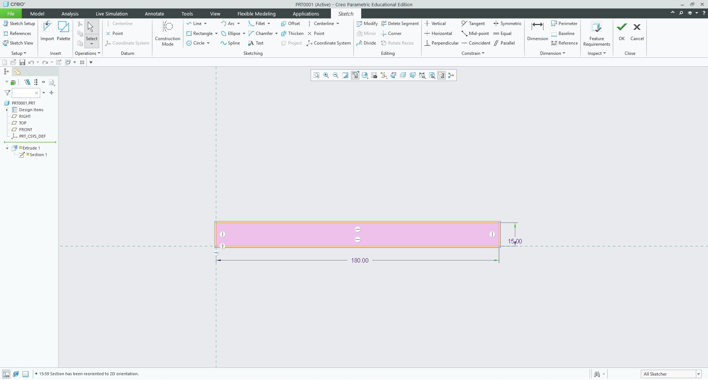
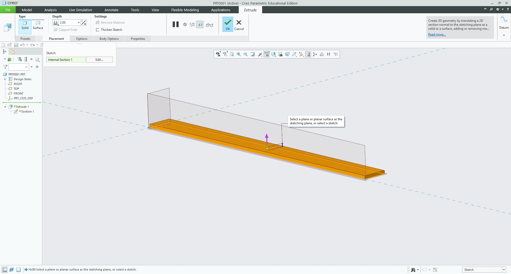
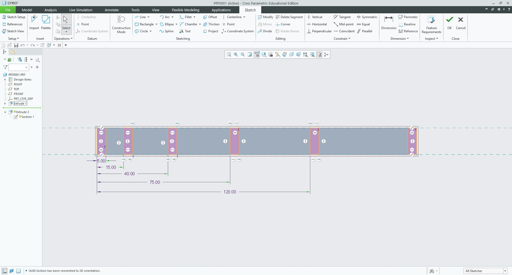
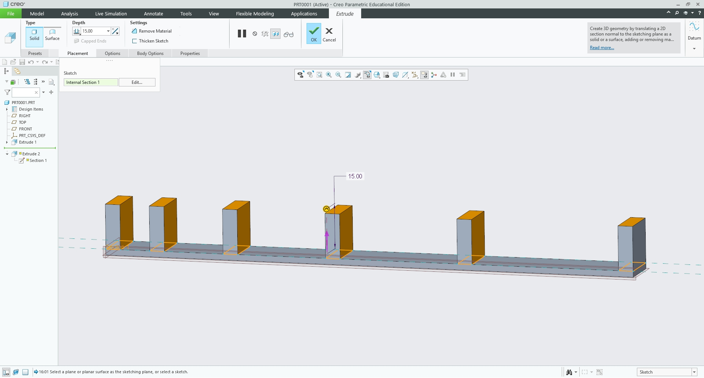
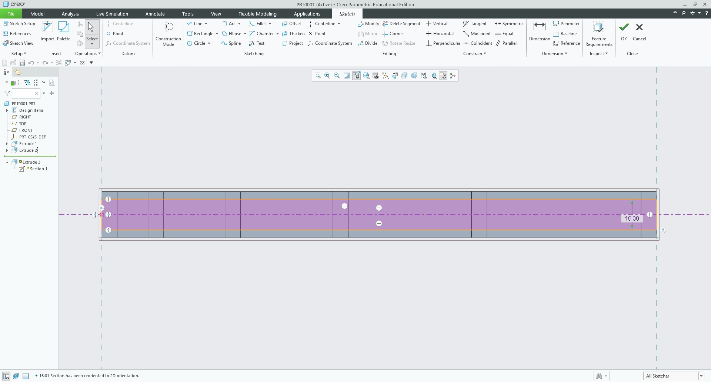
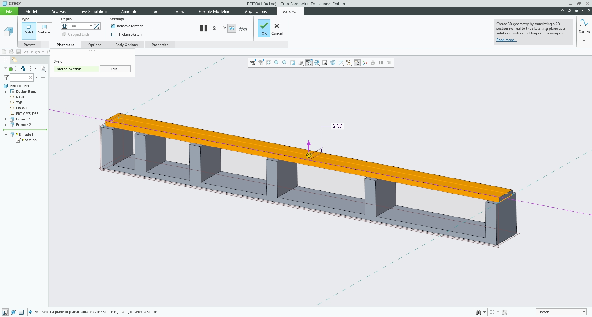
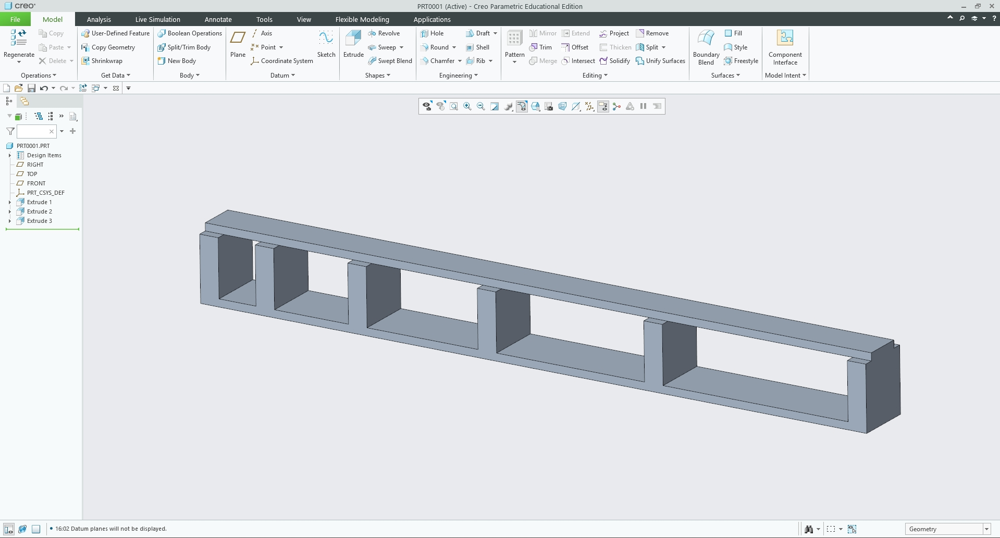
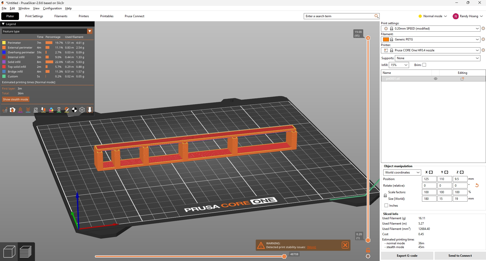
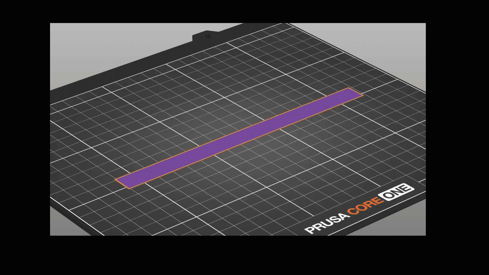
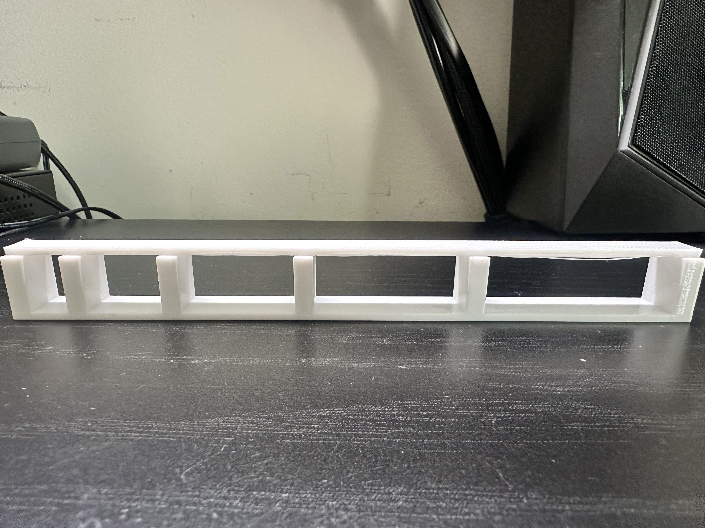

# Lab Assignment – FDM Bridging Tolerance Benchmark

<small>***(Clicking on the images will enlarge them)***</small>

## Design and Modeling Steps
For this lab, I wanted to design an artifact to evaluate the bridging limits of the Prusa Core One 3D printer using PTC Creo. The goal was to test incrementally larger gaps (10 mm, 20 mm, 30 mm, 40 mm, and 50 mm) to see exactly where FDM extrusion over open air begins to sag or fail. Here is exactly how I built it step-by-step.

### 1. Modeling the Base Plate
I started with the foundation. First, I sketched a long rectangle on the top plane with dimensions of 180 mm (X) by 15 mm (Y). I extruded it symmetrically by 2 mm. A 2 mm thick base provides enough surface area for solid build-plate adhesion without wasting material.

  <figure style="display: inline-block; margin: 10px; vertical-align: top;">
    
    <figcaption style="font-size: 0.85em; color: gray; margin-top: 5px;">
      Base Plate Sketch (180 mm x 15 mm)
    </figcaption>
  </figure>
  <figure style="display: inline-block; margin: 10px; vertical-align: top;">
    
    <figcaption style="font-size: 0.85em; color: gray; margin-top: 5px;">
      Symmetric Extrusion to 2 mm
    </figcaption>
  </figure>

### 2. Modeling the Vertical Pillars
Next, I created a sketch on the top surface of the base plate for the vertical support pillars. I sketched six separate 5 mm x 15 mm rectangles, intentionally spacing them to create the 10, 20, 30, 40, and 50 mm gaps. I extruded these up by 15 mm to give enough vertical clearance to observe any sagging material from beneath.

  <figure style="display: inline-block; margin: 10px; vertical-align: top;">
    
    <figcaption style="font-size: 0.85em; color: gray; margin-top: 5px;">
      Pillar Spacing Sketch
    </figcaption>
  </figure>
  <figure style="display: inline-block; margin: 10px; vertical-align: top;">
    
    <figcaption style="font-size: 0.85em; color: gray; margin-top: 5px;">
      Pillar Extrusion to 15 mm
    </figcaption>
  </figure>

### 3. Modeling the Bridging Roof
For the final bridge, I sketched a single continuous roof spanning all the pillars. I made this 180 mm long but only 10 mm wide (centered on the 15 mm wide pillars). This was a critical design choice: leaving a 2.5 mm exposed shoulder forces the slicer to anchor the filament onto the solid pillar before traversing the empty gap, rather than dragging the perimeter in a straight line over the edge.

  <figure style="display: inline-block; margin: 10px; vertical-align: top;">
    
    <figcaption style="font-size: 0.85em; color: gray; margin-top: 5px;">
      10 mm Wide Roof Sketch
    </figcaption>
  </figure>
  <figure style="display: inline-block; margin: 10px; vertical-align: top;">
    
    <figcaption style="font-size: 0.85em; color: gray; margin-top: 5px;">
      Roof Extruded 2 mm Thick
    </figcaption>
  </figure>

  <figure style="display: inline-block; margin: 10px; vertical-align: top;">
    
    <figcaption style="font-size: 0.85em; color: gray; margin-top: 5px;">
      Final 3D Model of the Bridging Benchmark in Creo
    </figcaption>
  </figure>

## Research
Before printing unsupported spans, I researched the mechanical and thermal dynamics of bridging in FDM printing:

* **Material Viscosity:** Materials like PLA cool rapidly and have lower melt viscosity, making them excellent for bridging. PETG stays fluid longer, meaning gravity has more time to pull it down before the part-cooling fan can freeze it in mid-air.
* **Extrusion Speed vs. Fan Speed:** Successful bridges rely on a high fan speed (often 100%) and a specific travel speed. Moving too fast snaps the filament; moving too slow causes it to melt and sag.
* **Anchoring:** A bridge must have a solid perimeter wall to anchor to. If the toolpath doesn't overlap enough solid infill on the supporting pillars, the tension of the extruded line will pull it loose.

**How does cooling affect bridging performance?**
Cooling is the single most important factor. The printer must stretch a line of molten plastic across an empty void. Without immediate, directional cooling from the fan, the plastic's thermal mass will cause it to droop.

**How do you fix spans that are too long to bridge?**
When gaps exceed the printer's bridging limits (usually past 30–50 mm depending on the material), you must either change the print orientation to place the gap against the build plate, or enable sacrificial support structures in the slicer to hold the plastic up.

## Preprocessor and Printing
* **Build Orientation:** I laid the model flat on its base (XY plane). This was the only way to accurately test bridging, forcing the printer to span the horizontal gaps over open air.
* **Material Selection:** We used generic PETG instead of PLA. Because PETG is inherently harder to bridge, this served as a strict stress test for the machine.
* **Supports:** **None.** Support material was explicitly disabled. Generating supports would completely invalidate the benchmark.
* **Layer Height:** We used the **0.20 mm SPEED** profile. This balances extrusion volume and nozzle pressure perfectly. Thinner layers stretch and snap, while thicker layers carry too much heat and sag.

  <figure style="display: inline-block; margin: 10px; vertical-align: top;">
    
    <figcaption style="font-size: 0.85em; color: gray; margin-top: 5px;">
      PrusaSlicer Settings (Supports Disabled)
    </figcaption>
  </figure>
  <figure style="display: inline-block; margin: 10px; vertical-align: top;">
    
    <figcaption style="font-size: 0.85em; color: gray; margin-top: 5px;">
      PrusaSlicer Toolpath Timelapse
    </figcaption>
  </figure>

## Print
We printed this at the Rapid Lab using the Prusa Core One. The total print time was exactly 36 minutes.

  <figure style="display: inline-block; margin: 10px; width: 50%; vertical-align: top;">
    <video width="100%" controls>
      <source src="0910 (1).mp4" type="video/mp4">
      Your browser does not support the video tag.
    </video>
    <figcaption style="font-size: 0.85em; color: gray; margin-top: 8px; text-align: center;">
      3D Printing the 50mm Span
    </figcaption>
  </figure>

**Stipulation Checklist:**
* **Test varying span lengths:** Pass (10 to 50 mm)
* **No overhang supports used:** Pass
* **Print in PLA/PETG:** Pass (PETG)
* **Time < 1.5 hours:** Pass (36 minutes)

  <figure style="display: inline-block; margin: 10px; vertical-align: top;">
    
    <figcaption style="font-size: 0.85em; color: gray; margin-top: 5px;">
      Final 3D Printed Bridging Benchmark
    </figcaption>
  </figure>

## Lessons Learned
This print was highly successful but showed clear mechanical limits. The short and mid-spans (10 mm, 20 mm, and 30 mm) printed flawlessly. The part-cooling fan solidified the PETG rapidly enough to maintain a perfectly flat roof. 

However, at the 40 mm and 50 mm lengths, the limitations of PETG showed up. While the top structural layers finished cleanly and the bridge held, looking at the underside revealed that a single strand of perimeter filament had failed to anchor properly and drooped down. The thermal mass of the filament was fighting gravity for just a fraction of a second too long.

If I were designing a real functional part (like an electronics enclosure with ports or a structural bracket), this test tells me I cannot safely design unsupported horizontal gaps larger than 30 mm when using PETG on this specific machine. Moving forward, I will ensure any gaps larger than that either feature 45-degree chamfered overhangs (teardrop holes) or use custom-painted supports in PrusaSlicer to guarantee a clean surface finish. 

## Resources

All design and printwork was done with:

<ul style="list-style-type: circle !important; padding-left: 20px;">
  <li style="list-style-type: circle !important; margin-bottom: 4px;">
    PTC Creo
  </li>
  <li style="list-style-type: circle !important; margin-bottom: 4px;">
    <a href="https://www.prusa3d.com/p/prusaslicer/" target="_blank">PrusaSlicer</a>
  </li>
  <li style="list-style-type: circle !important; margin-bottom: 4px;">
    Rapid Lab
  </li>
</ul>
