# Lab #5 Design a Snap Fit

<small>***(Clicking on the images will enlarge them)***</small>

## Part 1: Modeling and Calculations
For this lab, the objective was to design a robust, 3D-printable snap-fit mechanism, mathematically validate its structural integrity using a safety factor of 3.5, and create a parametric 3D model using PTC Creo. Polylactic Acid (PLA) was used as the baseline material for calculations. 

* **Young’s Modulus ($E$) for PLA:** ~300,000 psi
* **Yield Strength ($S_y$) for PLA:** ~6,000 psi
* **Maximum Allowable Stress ($\sigma_{allow}$):** 6,000 / 3.5 = 1,714 psi
* **Transverse Load ($P$):** 0.25 lbf (Insertion force)
* **Axial Load ($F_a$):** 5.0 lbf (Pull-out force)

### Solving for the Length of the Flexure
Using the cantilever beam equation with a concentrated load at the free end, I solved for the beam length ($L$) using an initial width ($b$) of 0.125 inches and a thickness ($h$) of 0.10 inches. 

$$\sigma = \frac{M \cdot c}{I} = \frac{(P \cdot L) \cdot (h / 2)}{\frac{b \cdot h^3}{12}} = \frac{6 \cdot P \cdot L}{b \cdot h^2}$$

Setting the stress to our allowable 1,714 psi limit:
$$1714 = \frac{6 \cdot 0.25 \cdot L}{0.125 \cdot (0.10)^2}$$
$$L \approx 1.42\text{ inches}$$

To maintain a compact assembly, I iteratively reduced $L$ to **1.00 inch**. Recalculating with 1.00 inch yields a bending stress of 1,200 psi, which safely remains below the 1,714 psi limit.

### Axial and Shear Stress
* **Axial Stress:** Under a 5 lbf pull-out load, $\sigma_a = \frac{5}{0.125 \cdot 0.10} = 400\text{ psi}$ (Safe).
* **Shear Stress:** The locking lip has a 0.20 inch ramp. $\tau = \frac{5}{0.20 \cdot 0.125} = 200\text{ psi}$ (Safe).

## Part 2: Parametric Design Steps
The design was modeled in PTC Creo entirely using parameters and relations (e.g., `BEAM_L = 1.00`, `BOX_DEPTH = 0.78`). 

### 1. Modeling the Buckle Plug
I started by defining the parameters in Creo's tools menu. Then, I sketched the base block and the 1.00-inch long prongs, using relations to tie the sketch dimensions directly to the parametric variables.

  <figure style="display: inline-block; margin: 10px; vertical-align: top;">
    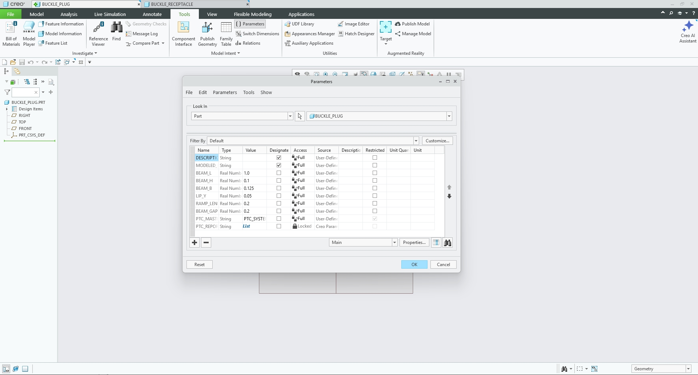
    <figcaption style="font-size: 0.85em; color: gray; margin-top: 5px;">
      Defining Parameters in Creo
    </figcaption>
  </figure>
  <figure style="display: inline-block; margin: 10px; vertical-align: top;">
    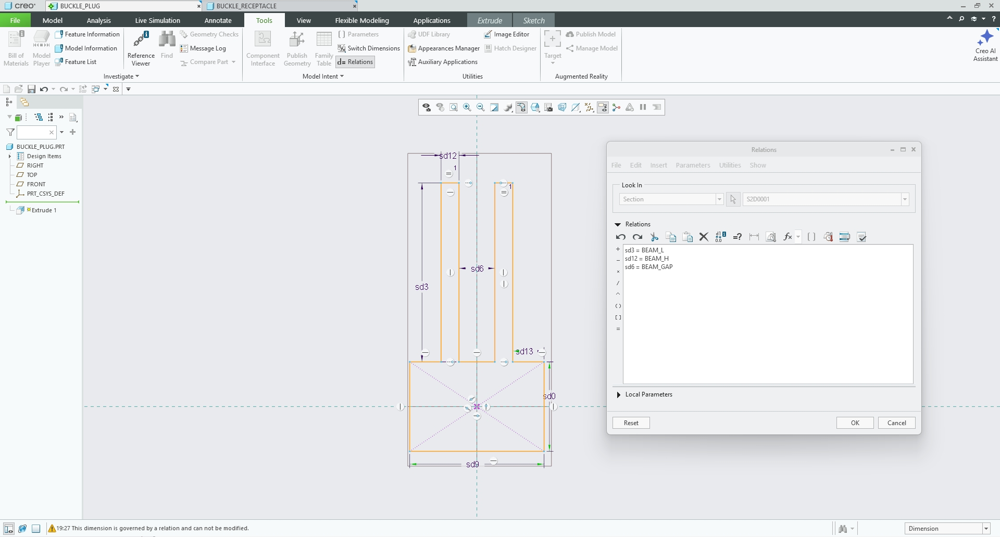
    <figcaption style="font-size: 0.85em; color: gray; margin-top: 5px;">
      Base Block and Prong Sketch
    </figcaption>
  </figure>

After confirming the sketch, I set the relations for the 0.125-inch depth and completed the extrusion of the plug's base and main prongs.

  <figure style="display: inline-block; margin: 10px; vertical-align: top;">
    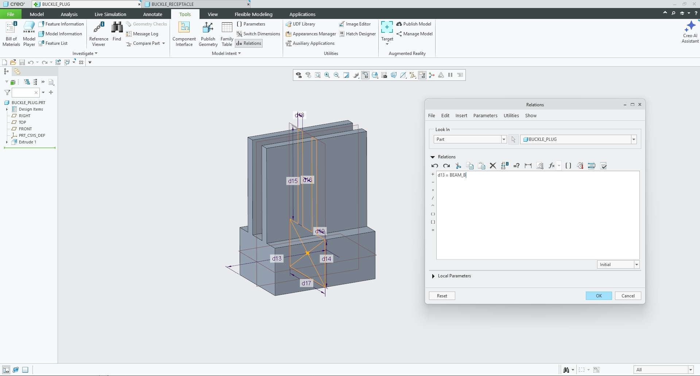
    <figcaption style="font-size: 0.85em; color: gray; margin-top: 5px;">
      Setting Relations for the Extrude Depth
    </figcaption>
  </figure>
  <figure style="display: inline-block; margin: 10px; vertical-align: top;">
    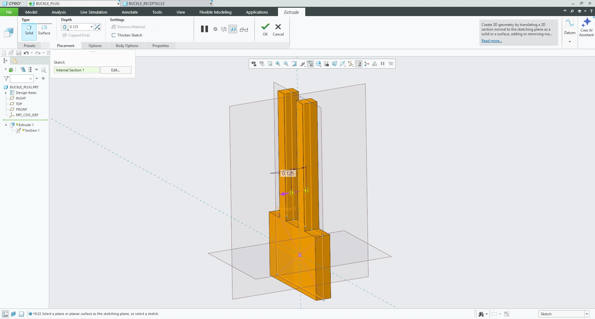
    <figcaption style="font-size: 0.85em; color: gray; margin-top: 5px;">
      Complete Extrusion of Base and Prongs
    </figcaption>
  </figure>

Next, I sketched the triangular locking lips using mirror constraints and relations to ensure symmetry. I extruded the triangles, adding a 14-degree angle to provide a smooth, gradual insertion slope.

  <figure style="display: inline-block; margin: 10px; vertical-align: top;">
    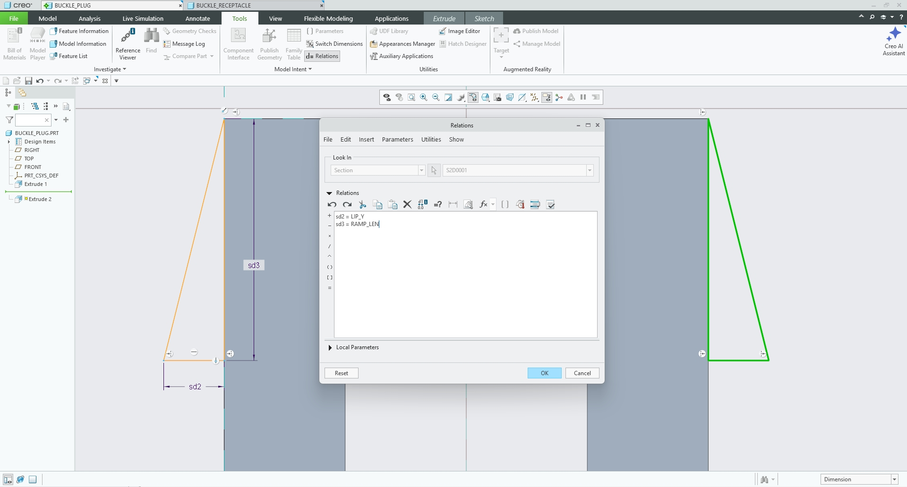
    <figcaption style="font-size: 0.85em; color: gray; margin-top: 5px;">
      Triangle Sketch, Mirror, and Relations
    </figcaption>
  </figure>
  <figure style="display: inline-block; margin: 10px; vertical-align: top;">
    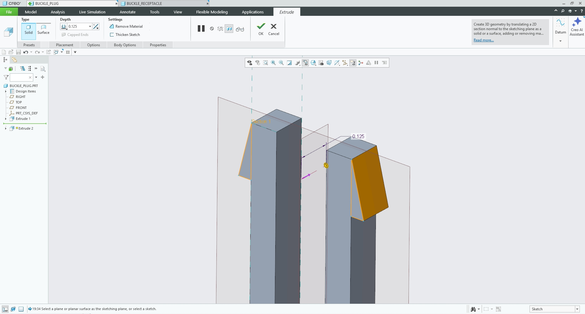
    <figcaption style="font-size: 0.85em; color: gray; margin-top: 5px;">
      Extrusion of the Locking Triangle
    </figcaption>
  </figure>

To finalize the plug, I rounded the inner corners at the base of the cantilever beams to relieve stress concentrations, leaving the finished plug geometry ready for assembly.

  <figure style="display: inline-block; margin: 10px; vertical-align: top;">
    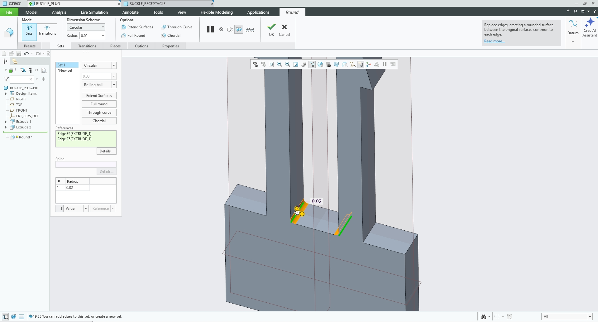
    <figcaption style="font-size: 0.85em; color: gray; margin-top: 5px;">
      Rounding the Inner Corners
    </figcaption>
  </figure>
  <figure style="display: inline-block; margin: 10px; vertical-align: top;">
    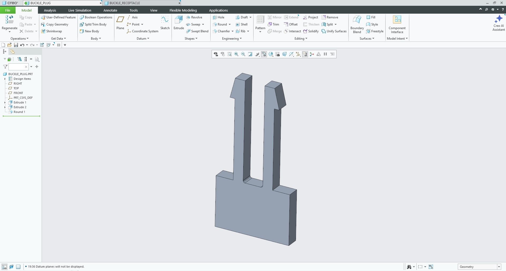
    <figcaption style="font-size: 0.85em; color: gray; margin-top: 5px;">
      Finished Product of the Plug
    </figcaption>
  </figure>

### 2. Modeling the Receptacle Box
For the receptacle, I sketched the outer block profile and the internal tunnel cut-out simultaneously. I engineered a 0.010-inch clearance into the tunnel dimensions to ensure the plug parts slide smoothly without binding. I then extruded the entire profile to a depth of 0.78 inches so the locking triangles would clear the back of the box and snap outward correctly.

  <figure style="display: inline-block; margin: 10px; vertical-align: top;">
    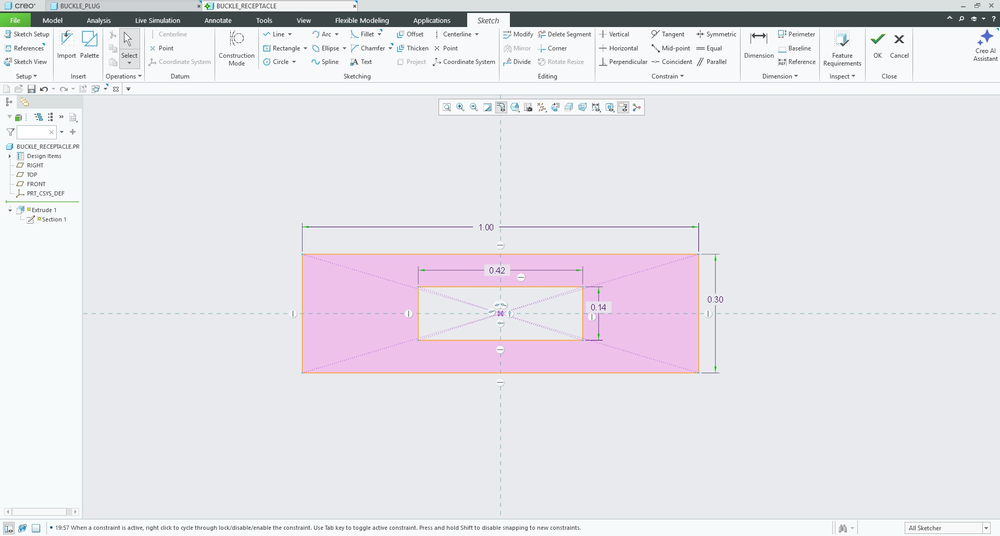
    <figcaption style="font-size: 0.85em; color: gray; margin-top: 5px;">
      Sketch of the Receptacle and Internal Tunnel
    </figcaption>
  </figure>
  <figure style="display: inline-block; margin: 10px; vertical-align: top;">
    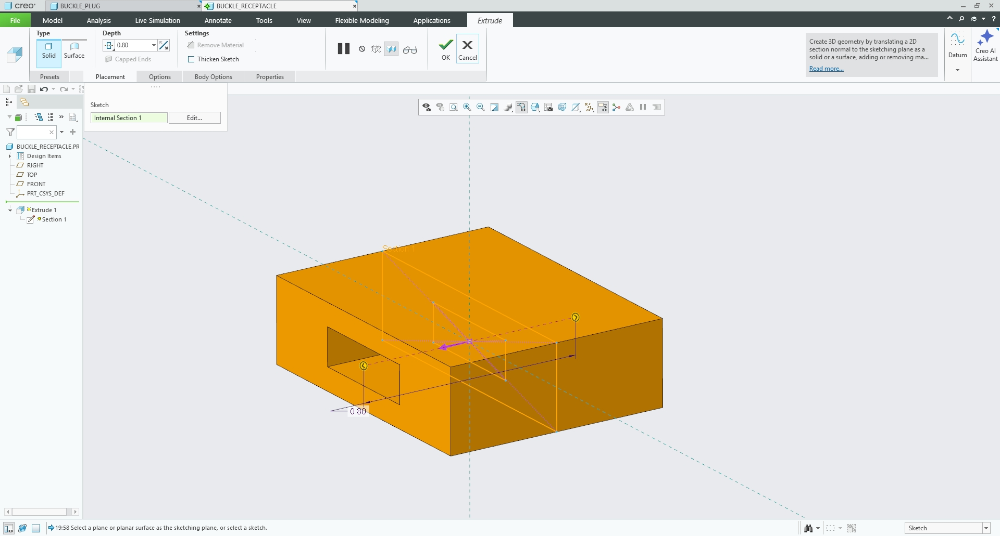
    <figcaption style="font-size: 0.85em; color: gray; margin-top: 5px;">
      Extrusion of the Receptacle (0.78 in Depth)
    </figcaption>
  </figure>

## Part 3: 3D Printing and Test 

### Research and Preprocessor
* **Build Orientation:** The parts were printed completely flat on their sides.
* **Material Selection:** PETG was chosen for the physical prototype due to its superior elasticity compared to PLA.
* **Supports:** No supports were needed for this print. The bridging capabilities of the printer handled the top wall of the tunnel perfectly, preventing any sagging and preserving the engineered 0.010-inch clearance.
* **Slicer Settings:** I used PrusaSlicer's **Speed** profile with a **Grid** infill pattern to minimize print time while retaining structural rigidity. 

  <figure style="display: inline-block; margin: 10px; vertical-align: top;">
    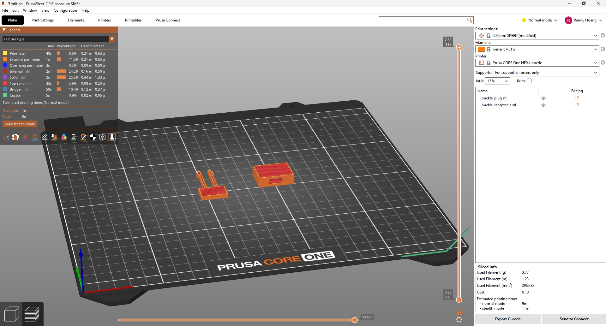
    <figcaption style="font-size: 0.85em; color: gray; margin-top: 5px;">
      PrusaSlicer Settings
    </figcaption>
  </figure>

### Print and Testing
I printed the two parts at the Rapid Lab using the Prusa Core One. The total print time for both pieces was exactly 10 minutes.

  <figure style="display: inline-block; margin: 10px; width: 50%; vertical-align: top;">
    <video width="100%" controls>
      <source src="print_video.mp4" type="video/mp4">
      Your browser does not support the video tag.
    </video>
    <figcaption style="font-size: 0.85em; color: gray; margin-top: 8px; text-align: center;">
      3D Printing the Snap-Fit Assembly in PETG
    </figcaption>
  </figure>

  <figure style="display: inline-block; margin: 10px; vertical-align: top;">
    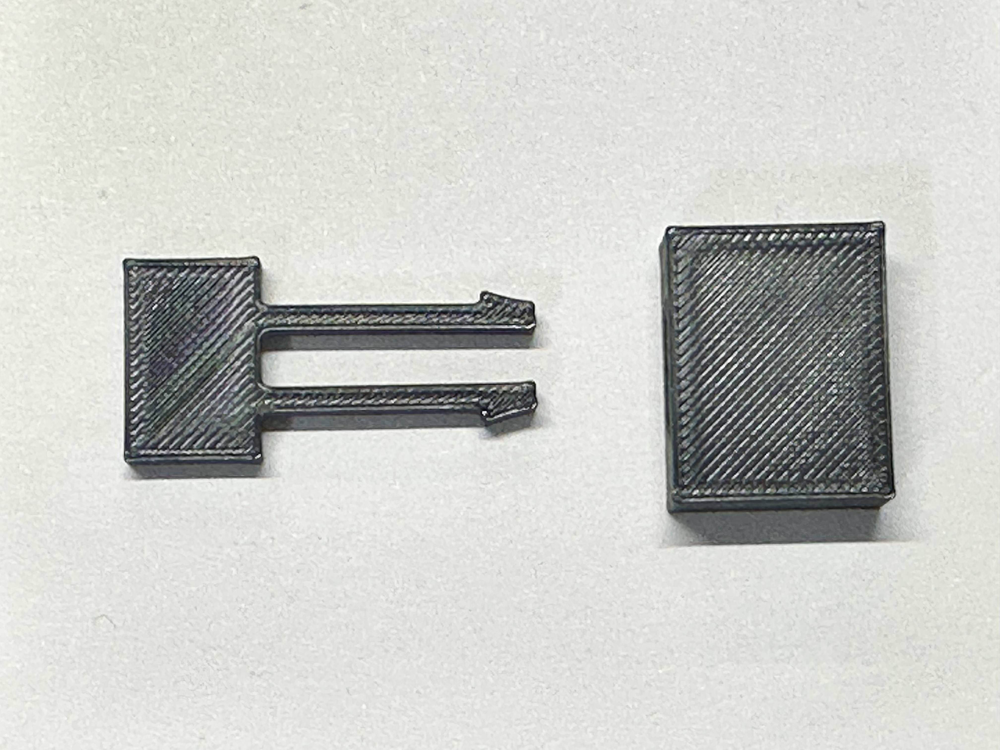
    <figcaption style="font-size: 0.85em; color: gray; margin-top: 5px;">
      Printed Parts (Disconnected)
    </figcaption>
  </figure>
  <figure style="display: inline-block; margin: 10px; vertical-align: top;">
    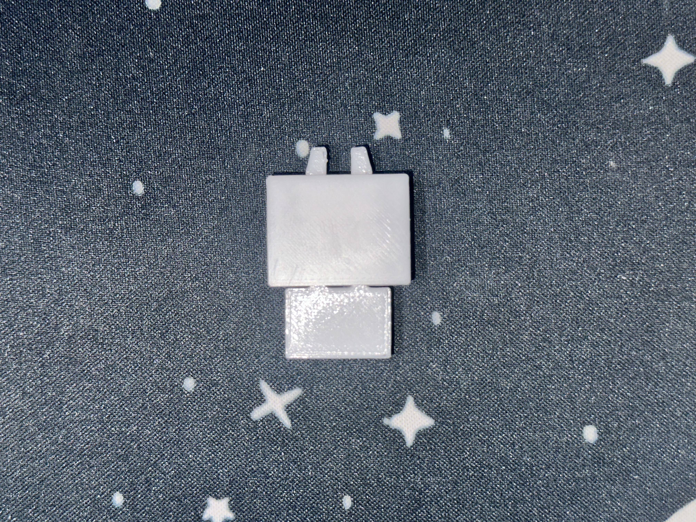
    <figcaption style="font-size: 0.85em; color: gray; margin-top: 5px;">
      Printed Parts (Connected)
    </figcaption>
  </figure>

  <figure style="display: inline-block; margin: 10px; width: 50%; vertical-align: top;">
    <video width="100%" controls>
      <source src="usage_video.mp4" type="video/mp4">
      Your browser does not support the video tag.
    </video>
    <figcaption style="font-size: 0.85em; color: gray; margin-top: 8px; text-align: center;">
      Testing the Snap-Fit Mechanism
    </figcaption>
  </figure>

### Lessons Learned
The test showed that the parts fit together perfectly. The 14-degree ramp allowed the plug to compress smoothly, and once the 0.20-inch triangle cleared the 0.78-inch depth of the box, it snapped right into place.

However, mechanical limitations quickly became apparent. While it snaps, the plug can be pulled out with only a little bit of force. It is currently only viable for lightweight situations. This lack of retention is due to a combination of the PETG's high flexibility, the thin 0.10-inch beam thickness, and the FDM process slightly rounding off the sharp 90-degree catch at the back of the locking triangle. 

To iterate and improve this design for heavier axial loads (5–10 lbf), I would need to adjust my parametric variables to increase `BEAM_H` (thickening the flexure) or modify the receptacle wall to trap the locking lip more aggressively.

## Resources

All design and printwork was done with:

<ul style="list-style-type: circle !important; padding-left: 20px;">
  <li style="list-style-type: circle !important; margin-bottom: 4px;">
    PTC Creo
  </li>
  <li style="list-style-type: circle !important; margin-bottom: 4px;">
    <a href="https://www.prusa3d.com/p/prusaslicer/" target="_blank">PrusaSlicer</a>
  </li>
  <li style="list-style-type: circle !important; margin-bottom: 4px;">
    Rapid Lab
  </li>
</ul>
