# Lab #7: Linkage Mechanisms

<small>***(Clicking on the images will enlarge them)***</small>

## 1. Research on Modern Linkage Mechanisms (10%)
Recent advancements in additive manufacturing have driven the development of compliant mechanisms—monolithic structures that transfer force and motion through elastic deformation rather than traditional sliding or rolling hardware joints. 

*   **Mechanism 1: 3D-Printed Series Elastic Actuators (SEAs)**
    *   **Function:** A 2025 study detailed the design of an openly available 3D-printed planetary gear SEA. The mechanism utilizes a torsional spring and planetary gear system to provide precise, compliant torque control in dynamic movements, effectively absorbing shock and mimicking the natural elasticity of biological muscles.
    *   **Industries:** Used in biomedical engineering for rehabilitation exoskeletons, and in assistive robotics for collaborative robots (cobots) to ensure safe physical interactions with operators.
    *   **Citation:** Card & Lowe (2025). "OpenSEA: a 3D printed planetary gear series elastic actuator." *Frontiers in Robotics and AI*.
*   **Mechanism 2: Topology-Optimized Micro-Tweezers**
    *   **Function:** Developed using micro-stereolithography, these 3D-printed micro-tweezers utilize a compliant mechanism where an input load elastically deforms the structure to close the tweezer tips. Topology optimization algorithms maximized tip displacement relative to input force.
    *   **Industries:** Used in life sciences for grasping microscale biological samples without causing cellular damage, and in micro-manufacturing for positioning MEMS components.
    *   **Citation:** Yamada et al. (2021). "3D-Printed Micro-Tweezers with a Compliant Mechanism." *Micromachines*.

## 2. Design and Engineering (45%)
**Purpose:** The objective is to produce a functional four-bar crank-rocker mechanism entirely out of 3D-printed components. The linkage converts a continuous 360-degree rotary input into an oscillating motion, utilizing custom-designed snap-fit pins to replace traditional metal hardware.

**Component Breakdown (8 Total Printed Parts)**

| Component | Function within Mechanism | Material | Qty |
| :--- | :--- | :--- | :--- |
| Ground Link (100 mm) | Anchors the fixed pivot points for the crank and rocker. | PLA | 1 |
| Input Crank (30 mm) | Continuously rotates 360 degrees to drive the system. | PLA | 1 |
| Coupler (100 mm) | Transfers motion from the rotating crank to the rocker. | PLA | 1 |
| Rocker (80 mm) | Oscillates in a constrained arc based on the coupler's pull. | PLA | 1 |
| Snap-Fit Pins | Pivot joints that compress elastically to lock the arms together. | PETG | 4 |

### Detailed CAD Procedure (PTC Creo)

**Phase 1: Modeling the Link Arms**
The link arms form the primary four-bar mechanism. The ground link was sketched with a 100 mm center-to-center distance and extruded to a 4.0 mm thickness. The pivot holes were kept at a straight 5.0 mm diameter without chamfers. The 100 mm coupler uses the identical profile as the ground link, so its sketch was omitted from the gallery. The crank (30 mm) and rocker (80 mm) were sketched using the same parametric relations.

  <figure style="display: inline-block; margin: 10px; vertical-align: top;">
    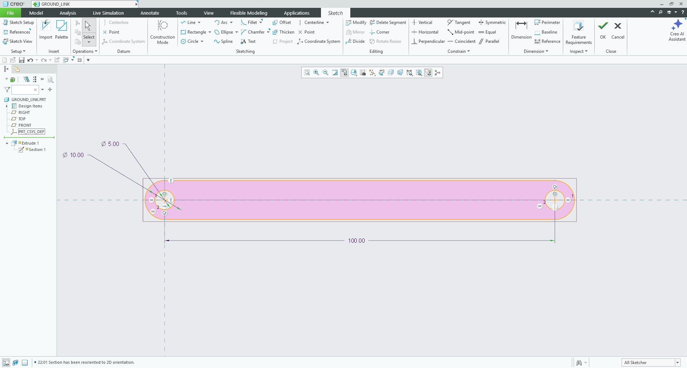
    <figcaption style="font-size: 0.85em; color: gray; margin-top: 5px;">
      1. Ground Link Sketch
    </figcaption>
  </figure>
  <figure style="display: inline-block; margin: 10px; vertical-align: top;">
    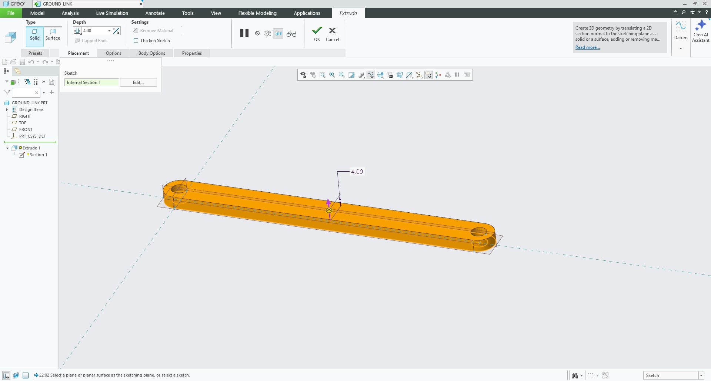
    <figcaption style="font-size: 0.85em; color: gray; margin-top: 5px;">
      2. Ground Link Extrude (4.0 mm)
    </figcaption>
  </figure>

  <figure style="display: inline-block; margin: 10px; vertical-align: top;">
    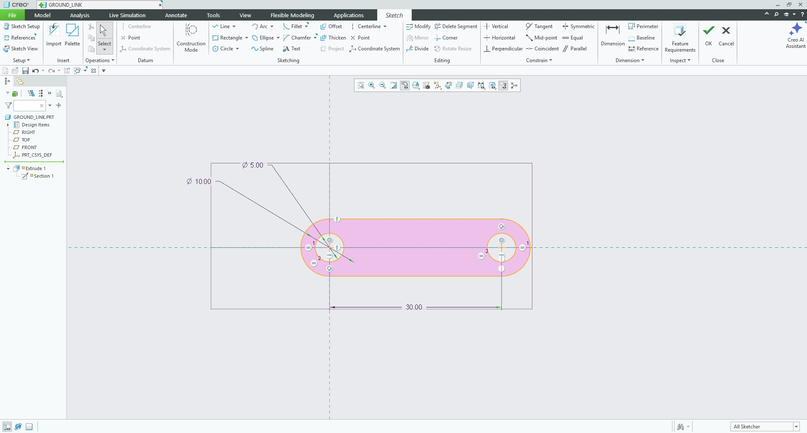
    <figcaption style="font-size: 0.85em; color: gray; margin-top: 5px;">
      3. Crank Sketch (30 mm length)
    </figcaption>
  </figure>
  <figure style="display: inline-block; margin: 10px; vertical-align: top;">
    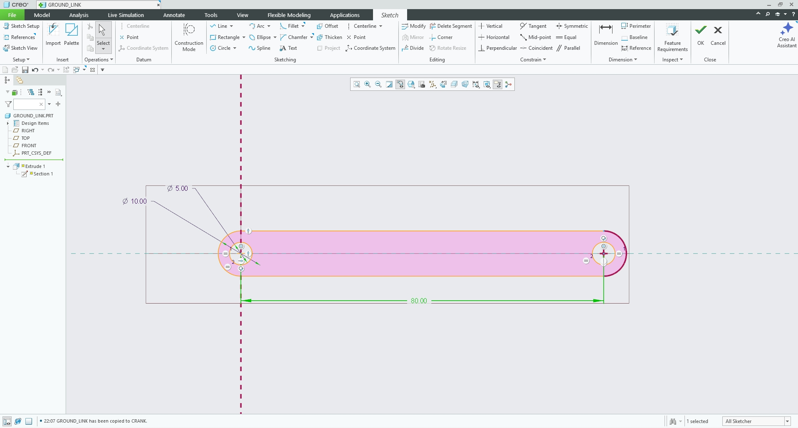
    <figcaption style="font-size: 0.85em; color: gray; margin-top: 5px;">
      4. Rocker Sketch (80 mm length)
    </figcaption>
  </figure>

**Phase 2: Modeling the Snap-Fit Pin**
To ensure the pins lock the PLA arms together while still allowing rotational clearance, they were modeled in multi-stage extrusions. The 8.0 mm base acts as the anchor, followed by the 4.6 mm shaft. The retaining tip was extruded wider to 5.5 mm and chamfered for insertion. Finally, a central flex slit was removed so the tip could compress during assembly.

  <figure style="display: inline-block; margin: 10px; vertical-align: top;">
    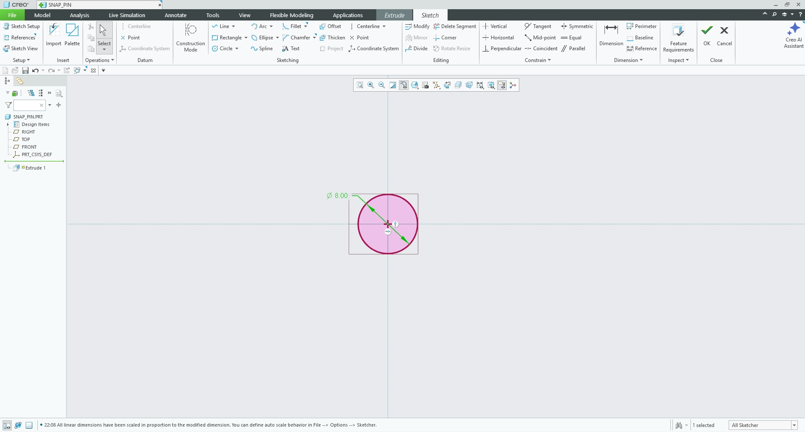
    <figcaption style="font-size: 0.85em; color: gray; margin-top: 5px;">
      5. Sketch of Pin Base
    </figcaption>
  </figure>
  <figure style="display: inline-block; margin: 10px; vertical-align: top;">
    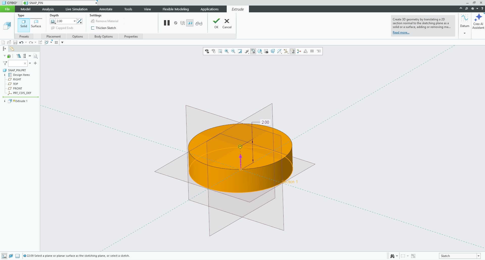
    <figcaption style="font-size: 0.85em; color: gray; margin-top: 5px;">
      6. Extrude of Pin Base
    </figcaption>
  </figure>

  <figure style="display: inline-block; margin: 10px; vertical-align: top;">
    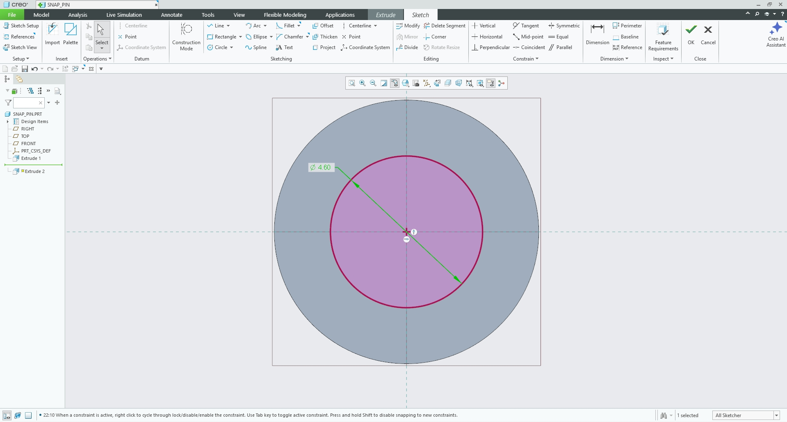
    <figcaption style="font-size: 0.85em; color: gray; margin-top: 5px;">
      7. Sketch of Pin Shaft
    </figcaption>
  </figure>
  <figure style="display: inline-block; margin: 10px; vertical-align: top;">
    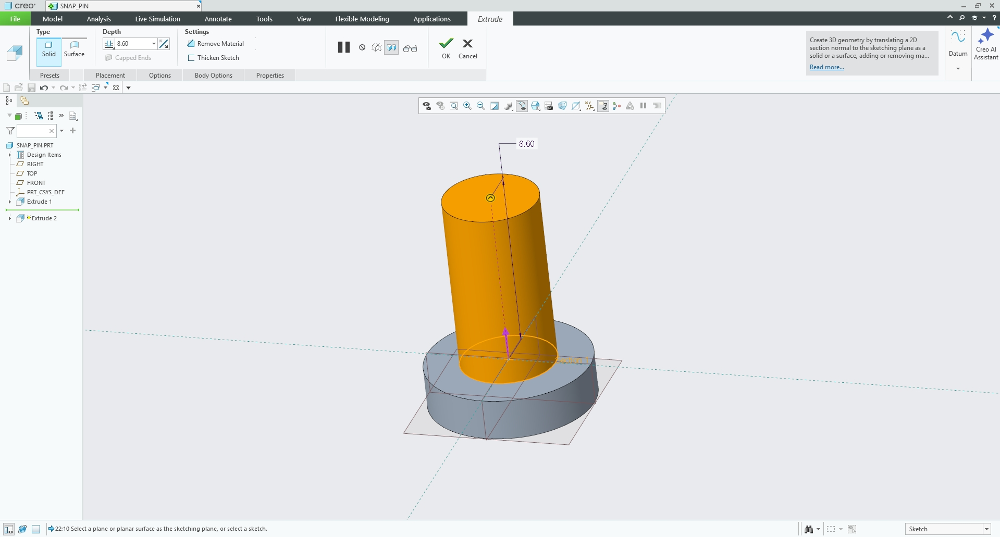
    <figcaption style="font-size: 0.85em; color: gray; margin-top: 5px;">
      8. Extrude of Pin Shaft
    </figcaption>
  </figure>

  <figure style="display: inline-block; margin: 5px; vertical-align: top;">
    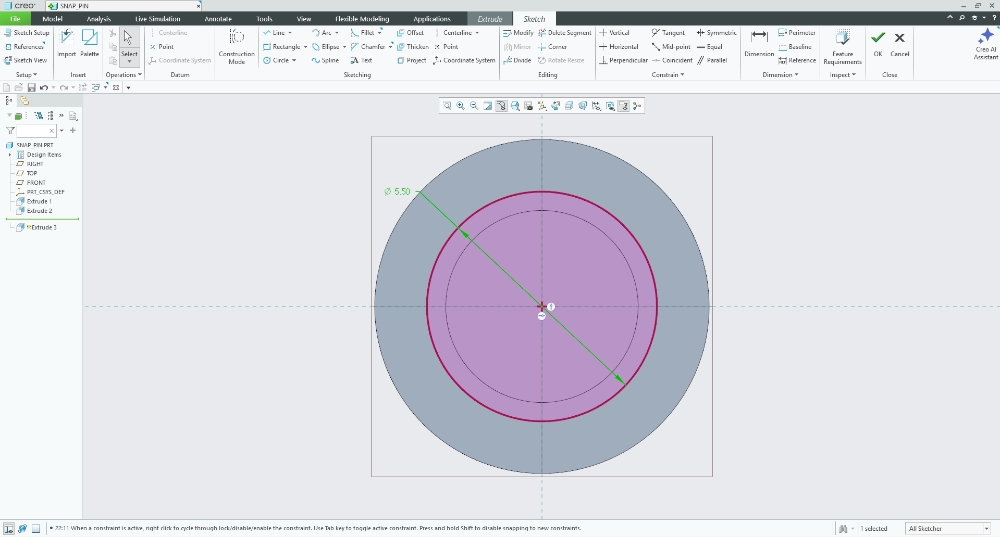
    <figcaption style="font-size: 0.85em; color: gray; margin-top: 5px;">
      9. Tip Sketch
    </figcaption>
  </figure>
  <figure style="display: inline-block; margin: 5px; vertical-align: top;">
    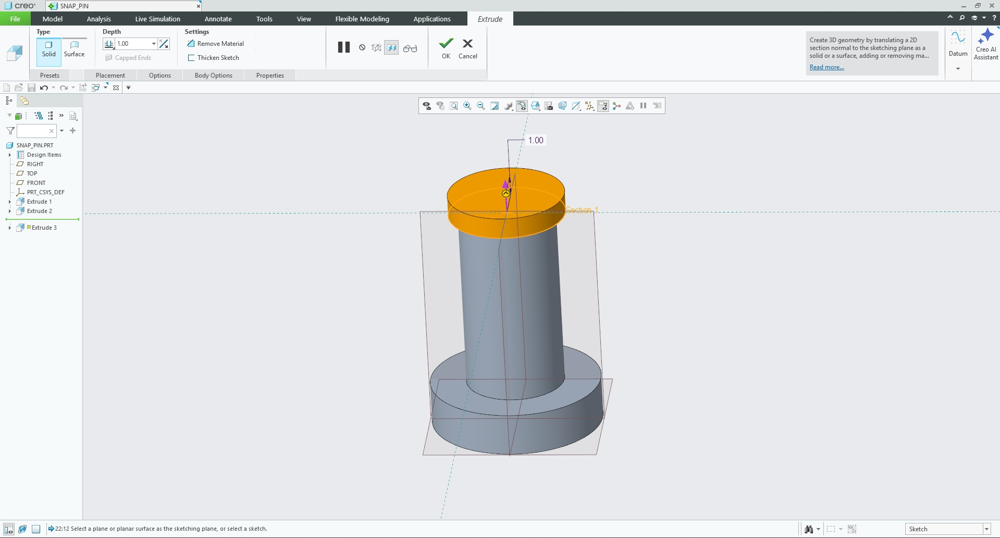
    <figcaption style="font-size: 0.85em; color: gray; margin-top: 5px;">
      10. Tip Extrude
    </figcaption>
  </figure>
  <figure style="display: inline-block; margin: 5px; vertical-align: top;">
    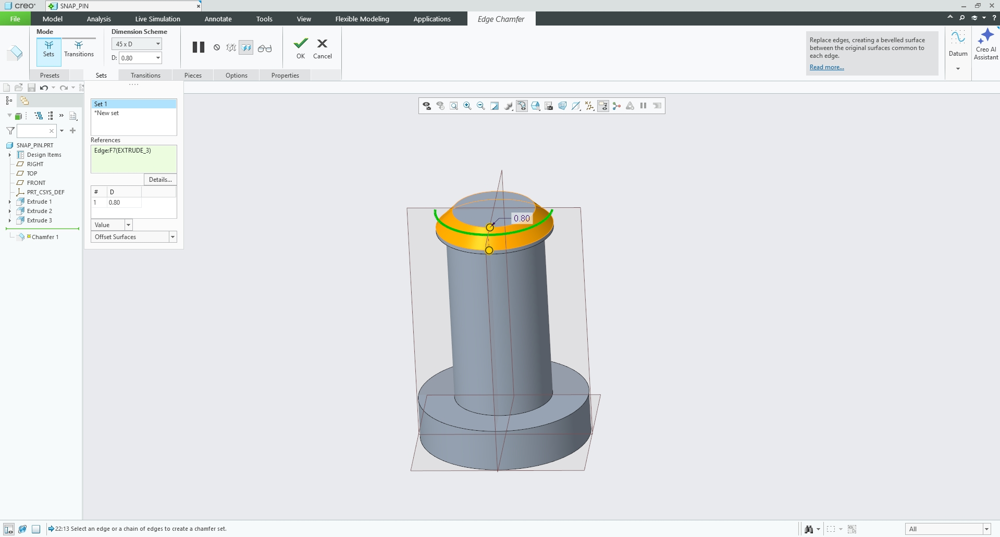
    <figcaption style="font-size: 0.85em; color: gray; margin-top: 5px;">
      11. Chamfer of Tip
    </figcaption>
  </figure>

  <figure style="display: inline-block; margin: 10px; vertical-align: top;">
    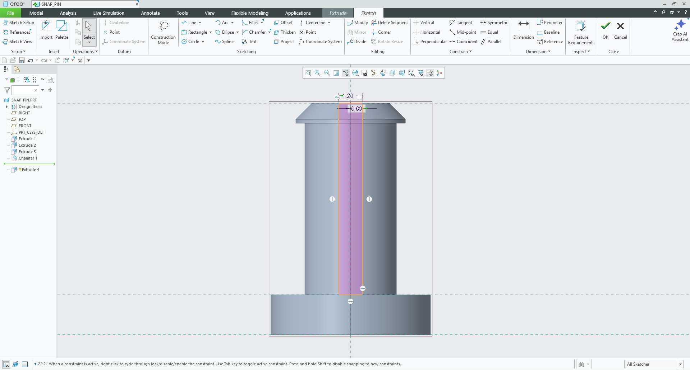
    <figcaption style="font-size: 0.85em; color: gray; margin-top: 5px;">
      12. Sketch for Material Removal
    </figcaption>
  </figure>
  <figure style="display: inline-block; margin: 10px; vertical-align: top;">
    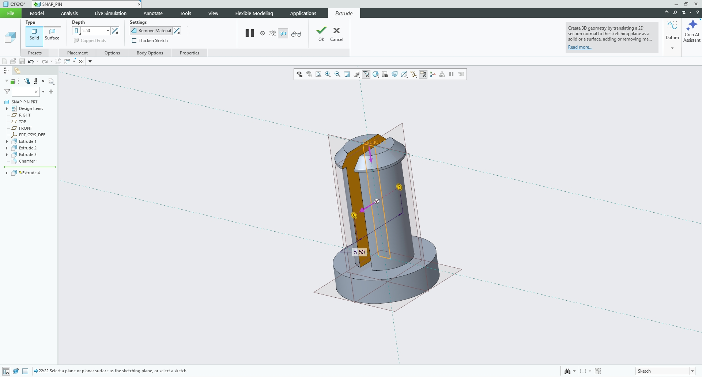
    <figcaption style="font-size: 0.85em; color: gray; margin-top: 5px;">
      13. Remove Material for Flex Slit
    </figcaption>
  </figure>

**Phase 3: Virtual Assembly**
The mechanism was assembled incrementally. The ground link was anchored first to provide a fixed coordinate system. The dynamic links were subsequently constrained in order—crank, coupler, then rocker—forming the continuous four-bar loop before checking the final product geometry. 

  <figure style="display: inline-block; margin: 10px; vertical-align: top;">
    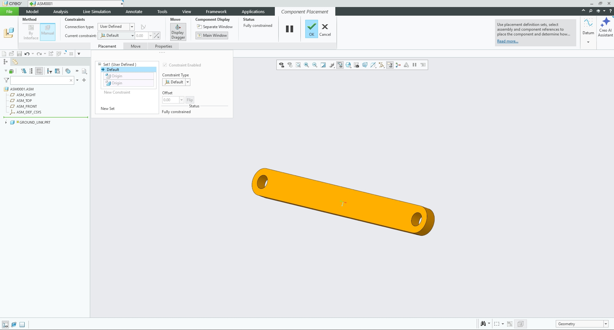
    <figcaption style="font-size: 0.85em; color: gray; margin-top: 5px;">
      14. Assembly: Ground Link Constraint (Default)
    </figcaption>
  </figure>
  <figure style="display: inline-block; margin: 10px; vertical-align: top;">
    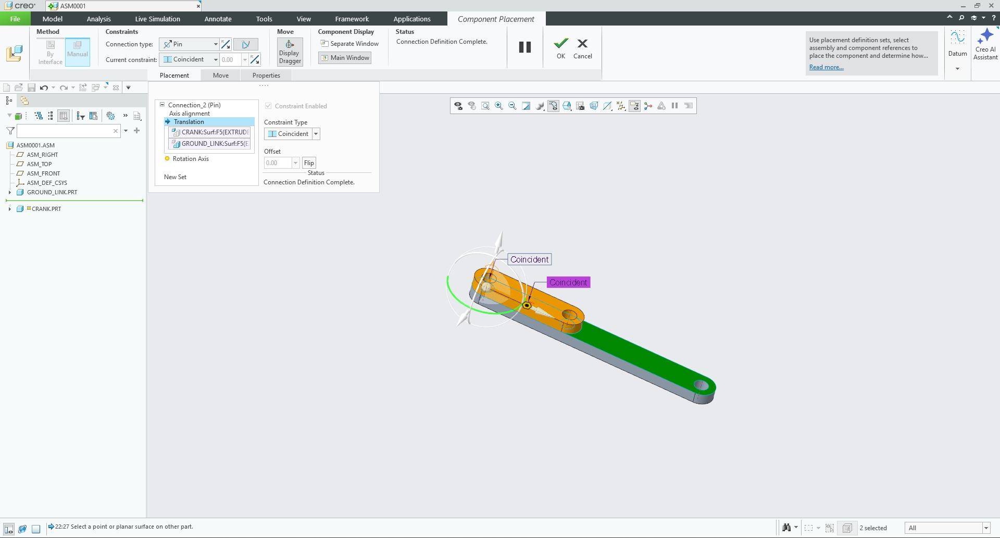
    <figcaption style="font-size: 0.85em; color: gray; margin-top: 5px;">
      15. Assembly: Crank Constraint
    </figcaption>
  </figure>

  <figure style="display: inline-block; margin: 10px; vertical-align: top;">
    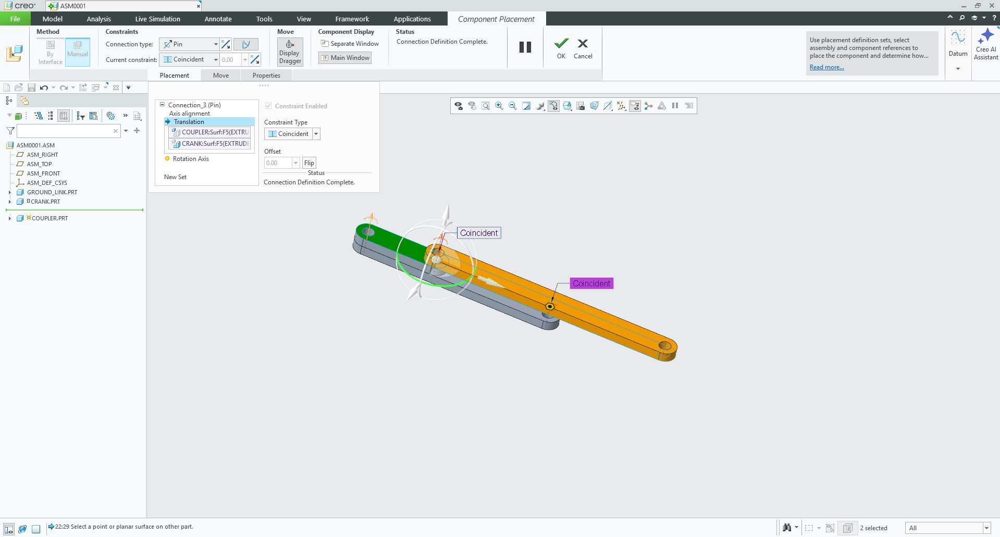
    <figcaption style="font-size: 0.85em; color: gray; margin-top: 5px;">
      16. Assembly: Coupler Constraint
    </figcaption>
  </figure>
  <figure style="display: inline-block; margin: 10px; vertical-align: top;">
    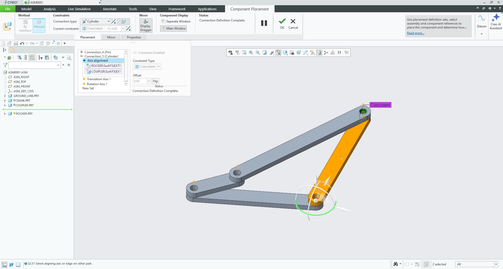
    <figcaption style="font-size: 0.85em; color: gray; margin-top: 5px;">
      17. Assembly: Rocker Constraint
    </figcaption>
  </figure>

  <figure style="display: inline-block; margin: 10px; vertical-align: top;">
    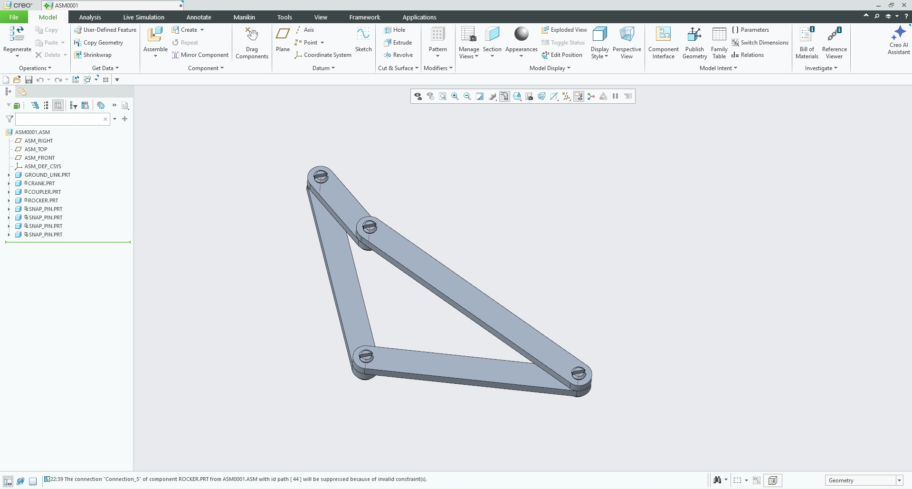
    <figcaption style="font-size: 0.85em; color: gray; margin-top: 5px;">
      18. Final Product of Assembly
    </figcaption>
  </figure>

  <figure style="display: inline-block; margin: 10px; width: 50%; vertical-align: top;">
    <video width="100%" controls>
      <source src="cad_animation.mp4" type="video/mp4">
      Your browser does not support the video tag.
    </video>
    <figcaption style="font-size: 0.85em; color: gray; margin-top: 8px; text-align: center;">
      CAD Kinematic Drag Simulation & Animation
    </figcaption>
  </figure>

## 3. Slicing & 3D Print Preparation (35%)
The STL files were processed in PrusaSlicer for manufacturing on a Prusa Core One. The slicing profiles were tailored separately for the static load requirements of the PLA links and the flexural shear requirements of the PETG pins.

**Link Slicing Strategy (PLA):**
The linkage arms prioritize speed and isotropic rigidity. The layers and perimeters were set to standard values, while a moderate gyroid infill was selected to save material without compromising structural integrity.

  <figure style="display: inline-block; margin: 5px; vertical-align: top;">
    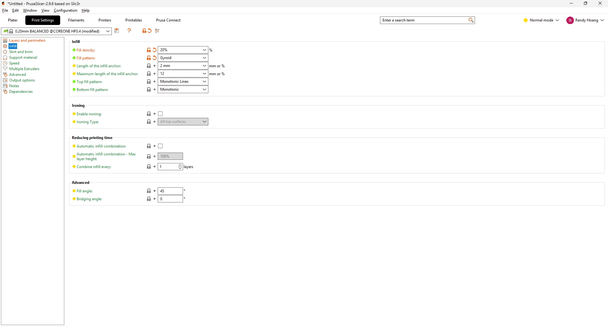
    <figcaption style="font-size: 0.85em; color: gray; margin-top: 5px;">
      19. Links: Infill Setting
    </figcaption>
  </figure>
  <figure style="display: inline-block; margin: 5px; vertical-align: top;">
    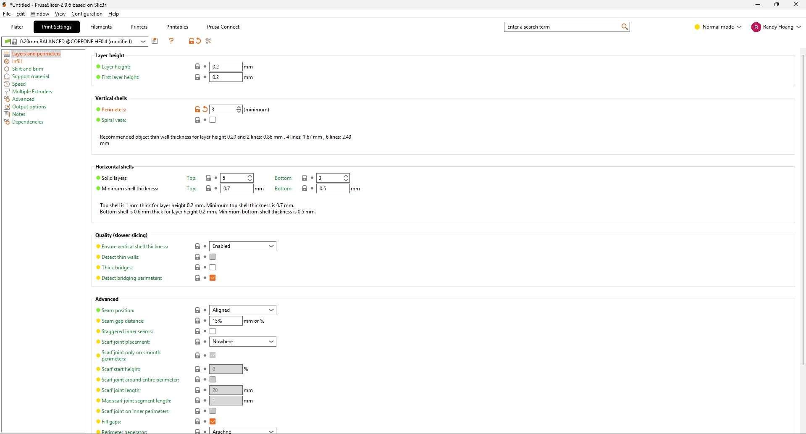
    <figcaption style="font-size: 0.85em; color: gray; margin-top: 5px;">
      20. Links: Layers and Perimeters
    </figcaption>
  </figure>
  <figure style="display: inline-block; margin: 5px; vertical-align: top;">
    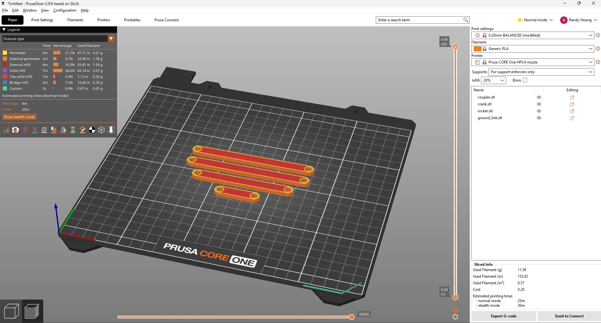
    <figcaption style="font-size: 0.85em; color: gray; margin-top: 5px;">
      21. Links: Slicing Output
    </figcaption>
  </figure>

**Pin Slicing Strategy (PETG):**
The snap-fit pins act as bearing surfaces and active springs. The infill was bumped up heavily, and the layers/perimeters settings were increased to ensure the 4.6 mm shaft and prongs were generated with solid, concentric structural walls to prevent shearing.

  <figure style="display: inline-block; margin: 5px; vertical-align: top;">
    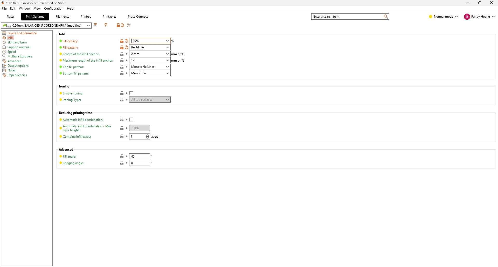
    <figcaption style="font-size: 0.85em; color: gray; margin-top: 5px;">
      22. Pins: Infill Setting
    </figcaption>
  </figure>
  <figure style="display: inline-block; margin: 5px; vertical-align: top;">
    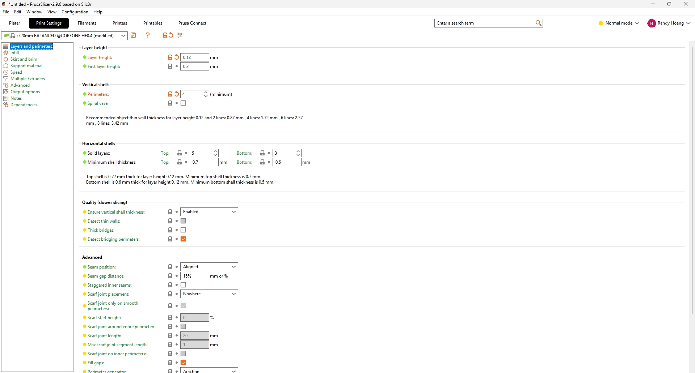
    <figcaption style="font-size: 0.85em; color: gray; margin-top: 5px;">
      23. Pins: Layers and Perimeters
    </figcaption>
  </figure>
  <figure style="display: inline-block; margin: 5px; vertical-align: top;">
    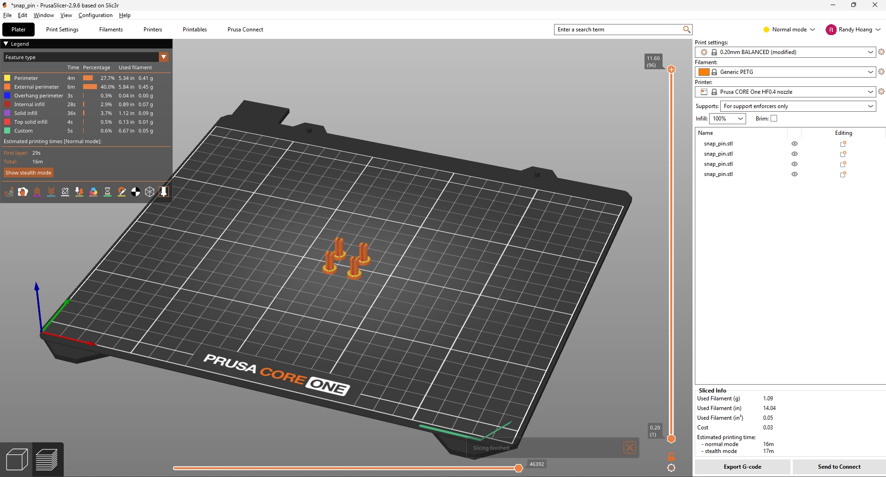
    <figcaption style="font-size: 0.85em; color: gray; margin-top: 5px;">
      24. Pins: Slicing Output
    </figcaption>
  </figure>

  <figure style="display: inline-block; margin: 10px; width: 50%; vertical-align: top;">
    <video width="100%" controls>
      <source src="printing_process.mp4" type="video/mp4">
      Your browser does not support the video tag.
    </video>
    <figcaption style="font-size: 0.85em; color: gray; margin-top: 8px; text-align: center;">
      3D Printing the Linkages and Pins on Prusa Core One
    </figcaption>
  </figure>

## 4. Lessons Learned (10%)

**Time Breakdown**

| Task Phase | Expected Time | Actual Time |
| :--- | :--- | :--- |
| Research & Documentation | 1.0 hr | 1.5 hrs |
| PTC Creo Modeling | 1.5 hrs | 2.5 hrs |
| PrusaSlicer Preparation | 0.5 hr | 0.5 hr |
| 3D Printing | 1.5 hrs | 2.0 hrs |
| Assembly & Kinematic Testing | 0.5 hr | 1.0 hr |
| **Total** | **5.0 hrs** | **7.5 hrs** |

**Tolerance Reflection & Design Iteration**
The most critical engineering lesson learned during this project involved managing dimensional tolerances and first-layer thermal squish ("elephant's foot") around the pivot holes. In the initial print, the 5.0 mm pivot holes in the PLA link arms experienced slight bottom-layer flare from the print bed, which reduced the effective clearance against the 4.6 mm PETG pin shafts and caused the joints to bind rather than rotate freely. 

To resolve this, we returned to PTC Creo and added a small 0.2 mm radial clearance offset to the pin-to-hole mating surfaces, while also fine-tuning the first-layer horizontal expansion settings in PrusaSlicer. This ensured crisp, clean hole edges without post-processing reaming, allowing the four-bar mechanism to cycle smoothly with minimal mechanical backlash.

  <figure style="display: inline-block; margin: 10px; width: 50%; vertical-align: top;">
    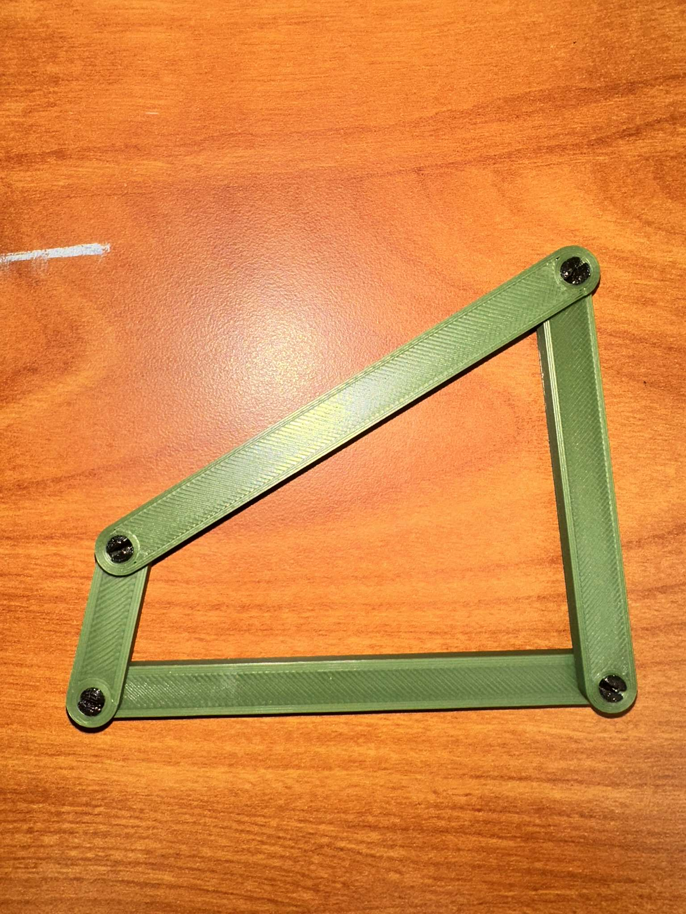
    <figcaption style="font-size: 0.85em; color: gray; margin-top: 8px; text-align: center;">
      Fully Assembled Four-Bar Linkage Mechanism (IRL)
    </figcaption>
  </figure>

  <figure style="display: inline-block; margin: 10px; width: 50%; vertical-align: top;">
    <video width="100%" controls>
      <source src="linkages_irl.mp4" type="video/mp4">
      Your browser does not support the video tag.
    </video>
    <figcaption style="font-size: 0.85em; color: gray; margin-top: 8px; text-align: center;">
      Operating the Fully Assembled Four-Bar Linkage IRL
    </figcaption>
  </figure>

## Resources

All design and print work was done with:

<ul style="list-style-type: circle !important; padding-left: 20px;">
  <li style="list-style-type: circle !important; margin-bottom: 4px;">
    PTC Creo
  </li>
  <li style="list-style-type: circle !important; margin-bottom: 4px;">
    <a href="https://www.prusa3d.com/p/prusaslicer/" target="_blank">PrusaSlicer</a>
  </li>
  <li style="list-style-type: circle !important; margin-bottom: 4px;">
    Prusa CORE One
  </li>
  <li style="list-style-type: circle !important; margin-bottom: 4px;">
    Card & Lowe (2025). "OpenSEA: a 3D printed planetary gear series elastic actuator." <i>Frontiers in Robotics and AI</i>.
  </li>
  <li style="list-style-type: circle !important; margin-bottom: 4px;">
    Yamada et al. (2021). "3D-Printed Micro-Tweezers with a Compliant Mechanism." <i>Micromachines</i>.
  </li>
</ul>

Total time from start to finish: ~7.5 hours (1.5 hours research, 2.5 hours CAD modeling, 2.5 hours slicing and printing, 1.0 hour testing).
