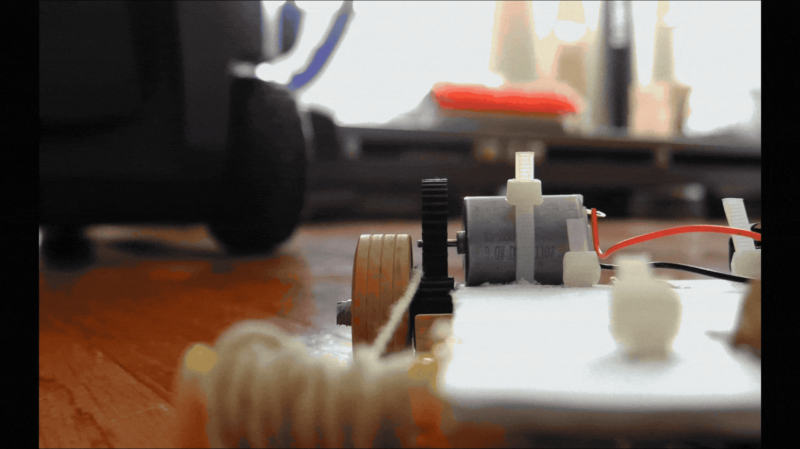

## About Me

I have always been fascinated by how things work and how far they can take us. Growing up with a father who is a mechanical engineer, I was surrounded by the language of design and building from day one. That early foundation naturally evolved into a lifelong love for space exploration and the work being done at NASA.

I approach engineering as both a rigorous technical discipline and a creative outlet. Whether I am modeling complex parts in Creo, wiring microcontrollers, or managing visual strategy as Media Director for the Asian Student Association, my goal is always to build things that are highly functional and visually compelling. 

My journey through design projects and hands-on lab work has taught me how to bridge the gap between raw engineering and clean execution. I love diving into complex hardware builds just as much as I love communicating the story behind the final product.

Download My <a href="Randy Hoang ENGR Resume.pdf" target="_blank">Resume</a>  
Minecraft is one of my favorite games ever that I have played since I was a child. I chose the pickaxe because I would mine for a lot of materials and make cool redstone contraptions in the game. So, I decided to make a keychain of it to travel with me every day.  

The size of the keychain was perfect for the maximum area and height that was given, so there was no resizing needed. The area of the print is 1.5658 x 1.5658 x 0.1811.  

